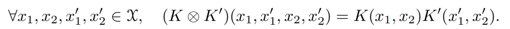

## 序

カーネル法とは、線形分類ができないデータに対して、**非線形変換によって指定の特徴空間へ写像することで、その空間上ではうまく線形分類できるようにする手法**。そんな都合の良い非線形変換なんてあるんでしょうか？ということについて考えてよう(だいたいある)。

上手いこと写像する非線形変換$\phi(\mathbf{x})$があるとする。ここで、**非線形変換自体は具体的には知らないが、内積$<\phi(\mathbf{a}), \phi(\mathbf{b})>$は知っているうえ、カーネル関数という形で求められる**のがみそである。わざわざ$\phi$を計算しなくていいので、$\mathbf{x}$の次元よりも写像先の特徴空間の次元が高い(よくある　表現力が高くすると無限次元になるし)ので、内積だけなら$O(\dim(\mathbf{x}))$で計算できる。

カーネル関数についての重要な定理たち。

## Mercer's Condition

データ空間が$\mathbf{x} \in X$とする。

$c(\cdot)$という二乗積分関数(つまり、$\int _{-\infty} ^ {\infty} |f(x)| ^ 2 dx$が収束する)があり、以下の式が成り立つとする。この式は、全てのデータ点の組み合わせにおいて、各データ点の係数$c(\mathbf{x})$を使って定義した時、ちゃんと正定値になる$K$ってことだと思う。

$$
\int \int _{X \times X} c(\mathbf{a}) c(\mathbf{b}) K(\mathbf{a}, \mathbf{b}) d\mathbf{a} d\mathbf{b} \geq 0
$$

この条件を満たすとき、カーネル関数$K$はなんと、無限次元の非線形写像による重ね合わせで表せると示されている。
具体的には、2つの写像を合成しても同じ形が出てくる=再生性があるといいですね=再生核ヒルベルト空間。
つまり、$\phi _i$は何なのかは知らないとしても、結果的に重ね合わせてきたカーネル関数はちゃんと使えるということが示されている。

$$
K(\mathbf{a}, \mathbf{b}) = \sum _{i = 0} ^ {\infty} a _i \phi _i(\mathbf{a}) \phi _i(\mathbf{b})
$$

正定値対称行列の二次形式の関数は凸関数なので、SVMの最適化において凸最適化になり、かならず最適解に行きつくので、**カーネル法を使ってもSVMは理想的な分類器のままになる**。

## 正定値対称カーネル

データ空間$X$が有限集合の時、グラム行列$\mathbf{K}$の$(i, j)$成分が$K(\mathbf{x} _i, \mathbf{x} _j)$の時、$K$は正定値対称カーネルであると言える。明らかに、カーネル関数は交換則が成り立つ必要がある。

以下に正定値カーネルの例を示す。

### 多項式カーネル

データの空間の次元を$N$、多項式の次元を$d$にすると、$ _{N + d} C _d$次元の特徴空間の上の内積とみなすことができる。$c$は定数。

$$
K(\mathbf{a}, \mathbf{b}) = (\mathbf{a} ^ T \mathbf{b} + c) ^ d
$$

例として、2次元のデータを$d = 2$に写像すると、以下のように6次元に置いての内積と考えられる。その6次元の上では、2次元では線形分離できなかったXORなどもできるようになる。

$$
(a _1 b _1 + a _2 b _2 + c) ^ 2 = (a _1 ^ 2, a _2 ^2, \sqrt{2} a _1 a _2, \sqrt{2c} a _1, \sqrt{2c} a _2, c) (b _1 ^ 2, b _2 ^2, \sqrt{2} b _1 b _2, \sqrt{2c} b _1, \sqrt{2c} b _2, c) ^ T
$$

ただ、多項式カーネルはMercer's Conditionを満たしているが、無限次元の日線形写像の重ね合わせではなさそう。見てるようにあくまで有限次元の積である。しかしMercer's Conditionにおいて$i$が大きい項を全部0西て打ち切ってしまえばいいので別に違反とは言えない。

### ガウシアンカーネル(RBFカーネル)

おそらく一番使うやつ。$\sigma$は定数。マクローリン展開のかたちもかける。マクローリン展開からわかるように、**ガウシアンカーネルはなんと多項式カーネルを無限次元重ねたものである**！

$$
K(\mathbf{a}, \mathbf{b}) = \exp(- \frac{|| \mathbf{a} - \mathbf{b} || ^ 2}{2 \sigma ^ 2})
= \sum _{i = 0} ^ \infty \frac{(\mathbf{a} ^ T \mathbf{b}) ^ n}{\sigma ^ {2n} n!}
$$

### シグモイドカーネル

$b, c$は定数である。

$$
K(\mathbf{a}, \mathbf{b}) = \tanh(c(\mathbf{a} ^ T \mathbf{c}) + b)
$$

色々弄ってみると$\tanh$とシグモイド関数は本質的には同じ関数であるのでこういう名前になっている。ただし、**$a \geq 0, b \geq 0$の時のみ正定値カーネルであるということに注意**。

## 再生核ヒルベルト空間

まず、正定値カーネルであるのならば、コーシー・シュワルツの不等式が成り立つ。証明は$\mathbf{a}, \mathbf{b}$によってのみなるグラム行列の行列式を考えれば、正定値行列であることから自明に以下の不等式となる。

$$
K(\mathbf{a}, \mathbf{b}) ^ 2 \leq K(\mathbf{a}, \mathbf{a}) K(\mathbf{b}, \mathbf{b})
$$

次に、再生核ヒルベルト空間について定義する。$K$が正定値カーネルである。以下のようなヒルベルト空間(完備性の公理が成り立つ=コーシー列が収束する、内積空間)が存在する。つまり、**夢の非線形写像$\phi$で写した空間はちゃんとヒルベルト空間$\mathcal{H}$であるということ**。

$$
\mathbf{a}, \mathbf{b} \in X, K(\mathbf{a}, \mathbf{b}) = <\boldsymbol{\phi}(\mathbf{a}), \boldsymbol{\phi}(\mathbf{b})>
$$

その上、そのヒルベルト空間$\mathcal{H}$において、次のようなことを考える。参考はこの[ページ](https://hgshrs.hatenablog.com/entry/20130331/1364707361)

関数空間(参考はこの[ページ](https://dora.bk.tsukuba.ac.jp/~takeuchi/?%E7%B7%9A%E5%BD%A2%E4%BB%A3%E6%95%B0II%2F%E9%96%A2%E6%95%B0%E7%A9%BA%E9%96%93))というものがある。定義域$I$内の全ての値を代入した値が作る、無限次元のベクトルで関数を表せると考える。すると、

- 内積は$f, g$が$\int _I f(x) \bar{g(x)} dx$　これが0なら直交
- ノルムは$\int _{I} |f(x)| ^ 2 dx$
- これらの関数空間のなかの関数を基底として、様々な別の関数を表現できる。
  - 関数を正規直交な関数系で係数付きで展開することをフーリエ式展開という。
  - フーリエという名前がついてる通りフーリエ級数展開とかはモロに関数空間と考えられるし、無限の基底があることも自然である。

今回は$\mathbf{x} _i \in X$の有限個の基底$K(\mathbf{x} _i, \cdot)$から作る関数のヒルベルト空間を考える。
そして、**$\mathbf{\phi}(\mathbf{x})$による写像は、有限の成分を持つベクトルではなく、無限の成分を持つ関数に写像するのである**(だから、カーネル法は無限次元の表現力があるというわけですね)これは、下式で必ず表せる。

$$
\phi(\mathbf{x}) = K(\mathbf{x}, \cdot) \\\\ 
f(\mathbf{t}) = \sum _{\mathbf{x} _i \in {X}} a _i K(\mathbf{x} _i, \mathbf{t}) \Leftrightarrow f 
= \sum _{\mathbf{x} _i \in {X}} a _i \phi(\mathbf{x} _i) = \sum _{\mathbf{x} _i \in {X}} a _i K(\mathbf{x} _i, \cdot)
$$

**関数空間においての基底を含む元は、関数なのでそこに入れる引数の代入枠を$\cdot$と置くのがふつうである**。

次は、関数$f = \sum _{i \in I} a _i K(\mathbf{x} _i, \cdot), g = \sum _{j \in J} b _j K(\mathbf{x} _j, \cdot)$についての内積を以下のように定義する。いずれも変数の代入を前提としている関数だが、内積を取るとスカラーになるのは普通のベクトル列と同じである。これらもまた、$f, g$に具体的に代入した形で記述することもできる。

$$
<f, g> = \sum _{i \in I, j \in J} a _i b _j K(\mathbf{x} _i, \mathbf{x} _j) =  \sum _{i \in I} a _i g(\mathbf{x} _i) = \sum _{j \in J} b _i f(\mathbf{x} _j)
$$

この内積の定義はしっかりコーシー・シュワルツの不等式、ノルム($|| f || _{\mathcal{H}}$)、交換可能性を満たしている。**満たしているので、この内積自体は正定値カーネルと考えられる**。コーシー・シュワルツの不等式から下式が得られる。

$$
<f, \phi(\mathbf{x})> \leq <f, f> <\phi(\mathbf{x}), \phi(\mathbf{x})>
$$

ここで、**正定値カーネルで定義したヒルベルト空間の内積もちゃんと正定値カーネルになっている**といういい性質があることに気づく。しかも下の式のように、**全く同じ正定値カーネルになる**！これが**再生性**！そして、ここでの**カーネル関数は再生核**という！下式では、正定値カーネルの基底で定義された任意の$f$について、任意の$\mathbf{x} \in X$に対して、$f$自身との内積を取ればまた$f$が出てくるということが得られる。

$$
\forall \mathbf{x} \in X, f(\mathbf{x}) = \sum _{i \in I} a _i K(\mathbf{x} _i, \mathbf{x}) = <f, K(\mathbf{x}, \cdot)> = <f, \phi(\mathbf{x})>
$$

ということで、**良いカーネル関数を選ぶ(そして上手くパラメタを当てはめる)ことが、カーネル法を使ったSVMの精度の鍵となる**。理論上上手くいくカーネル関数は必ず存在するが、どう見つけるとは言っていない……　一般的にはハイパーパラメタチューニングする。

また、カーネル関数は理論上関数空間の上の内積であるので、無限次元の上に全ての特徴は存在する。しかし、**再生核ヒルベルト空間を作る基底$\mathbf{x} _i$の数が実際の特徴空間の次元数になる**(幸い$\mathbf{x} _i$が違えば全部線形独立なのがいいところではある)。なので、データ数が増えると$\mathbf{x} _i$の数が増加していくノンパラメトリックな手法になる。もちろん運が非常に良い場合、わずか1つの$\mathbf{x} _i$を選んで上手いカーネル関数を選んだら複雑な非線形関係であっても、あっさり分類されることもある。

### 再生核ヒルベルト空間はカーネル関数と1対1である

再生核ヒルベルト空間はカーネル関数と1対1の対応関係にある。

対称性に関しては、
$$
k(\mathbf{a}, \mathbf{b}) = <\phi(\mathbf{a}), \phi(\mathbf{b})> = <\phi(\mathbf{b}), \phi(\mathbf{a})> = k(\mathbf{b}, \mathbf{a})
$$

以上のかたちとなり、成り立つ。

正定値性については、係数$c _1, \cdots, c _n$があり、元の空間の元$\mathbf{x} _1, \cdots, \mathbf{x} _n$があるとする。

$$
\sum _{i} \sum _{j} c _i c _j k(\mathbf{x} _i, \mathbf{x} _j) = 
\sum _{i} \sum _{j} c _i c _j <k(\mathbf{x} _i, \cdot), k(\mathbf{x} _j, \cdot)> \\\\
=<\sum _{i} c _i k(\mathbf{x} _i, \cdot), \sum _{j} c _j k(\mathbf{x} _j, \cdot)>
= || \sum _{i} c _i k(\mathbf{x} _i, \cdot) || ^2 \geq 0
$$

最後に、一意性を示す。1つの再生核ヒルベルト空間に対して、カーネル関数$k _1, k _2$が存在すると仮定し、いずれも再生核だとする。

$$
k _1(\mathbf{a}, \mathbf{b}) = <k _1(\mathbf{a}, \cdot), k _2(\mathbf{b}, \cdot)> = <k _2(\mathbf{a}, \cdot), k _1(\mathbf{b}, \cdot)> = k _2(\mathbf{a}, \mathbf{b})
$$

これが成り立ちので、$k _1 = k _2$となる。

## カーネル関数の性質

まず、カーネル関数は普通は$[0, 1]$に収まらないが、これを$0, 1$に収めることができる。と言ってもコーシー・シュワルツの関係式を使うことでcos類似度を代わりに出力し、それを正規化カーネル関数という。以下の式のように。完全に同じ方向のベクトルの時は+1となる。

$$
K ^ \prime (\mathbf{a}, \mathbf{b}) = 
\begin{cases}
0 \quad \mathrm{if} \quad K(\mathbf{a}, \mathbf{a}) = 0 \cup K(\mathbf{b}, \mathbf{b}) = 0 \\\\ 
\frac{K(\mathbf{a}, \mathbf{b})}{ \sqrt{K(\mathbf{a}, \mathbf{a}) K(\mathbf{b}, \mathbf{b})}}
\end{cases}
$$

また、前項でも言ったように、カーネル法は何個のankerを選べばよいのが不明であるが、複数個のankerがあるときは以下のように$\boldsymbol{\phi}(\mathbf{x})$を定義できる。$\mathbf{x} _1, \cdots$はデータ点から選んだもの(だったり、疑似的に生成したデータだったり)

$$
\boldsymbol{\Phi} = (K(\mathbf{x} _1, \cdot), \cdots, (K(\mathbf{x}) _m))
$$

この$\boldsymbol{\Phi}(\mathbf{x} _i)$は、$m$が取りうる最大の時には、成り立ちから計算すると$K \mathbf{e} _i$と同じである($i$列目を取り出した)。この前提で計算すると、下式が成り立つ。ここでの内積は関数空間のものではなく、普通のベクトルの内積。

$$
<\boldsymbol{\Phi}(\mathbf{x} _i), \boldsymbol{\Phi}(\mathbf{x} _j)> = (K \mathbf{e} _i) ^ T K \mathbf{e} _j = \mathbf{e} _i ^ T K ^ T K \mathbf{e} _j = \mathbf{e} _i ^ T K ^ 2 \mathbf{e} _j
$$

また、カーネル関数は前述のように合成することができる。**合成して自分だけの最強最適カーネル関数を作ろう**！次の演算に関して、正定値カーネルは閉じている！

- 和
- 積
- テンソル積 

- 各点収束
  - カーネル関数列$[K _n]$があるとき、$\lim _{n \to \infty} K _n (\mathbf{a}, \mathbf{b})$も正定値カーネル。
- べき級数
  - $\forall a _i \geq 0, \sum _{i = 0} ^ {\infty} a _i K ^ i (\mathbf{a}, \mathbf{b})$ カーネル関数を使ったこと式が収束する場合
  - $\exp(K(\mathbf{a}, \mathbf{b}))$は収束半径が∞なので、常に収束し正定値カーネルとなる。

## 表現定理

学習データ$(\mathbf{x} _i, y _i)$が$n$個与えられている。再生核ヒルベルト空間$\mathcal{H}$があり、元$f \in \mathcal{H}$は関数である。

これとは別に損失関数$L$が$n$変数関数であり、$b \in \mathbb{R}$とする。$\psi$は広義単調増加の関数である(正則化項扱い)。

$$
\argmin _{f \in \mathcal{H}, b \in \mathbb{R}} L(f(\mathbf{x} _1) + b, \cdots, f(\mathbf{x} _n) + b) + \psi(|| f || ^ 2)
$$

上記の式を最小化することを考える。この式の$f$をベクトルに置き換えれば、普通の線形分類のリスク関数とみなせる。関数なので無限次元のベクトルであるが、損失関数に代入するのは$n$個のデータ点$\mathbf{x} _i$を与えらえた時の返り値。

この式を最小化する$f$は、以下のようにデータ点$\mathbf{x} _i$と再生核$k$の線形合成で必ず得られる。係数は$\alpha _i$である。

$$
f = \sum _{i = 1} ^ n \alpha _i k(\mathbf{x} _i, \cdot)
$$

この定理の存在は、

1. いくつかのデータ点をアンカーとして、カーネル法を行い、関数空間へ写像する。
2. 写像した先で内積を取るという操作のみを行うため、カーネルトリックで結局有限次元のベクトルの計算となる。
3. その有限次元のベクトルの空間での係数の最適化をすれば、(そのカーネルトリックで選んだアンカーたちにおいての)最適解になる。

以上の事実を意味する。つまり、カーネル法をやるときでも、普通の線形の時と同じような最適化手法で問題がない。

## 普遍カーネル

