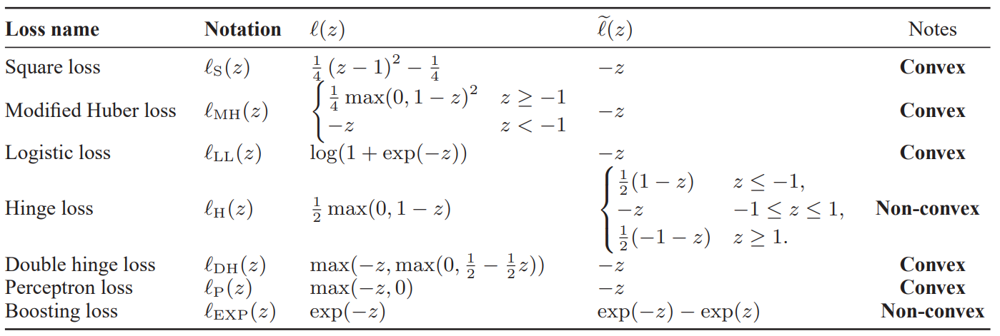

[論文リンク](https://proceedings.mlr.press/v37/plessis15.html)

[**中国語解説　とっても良い**](https://blog.csdn.net/crazy_scott/article/details/88993441)けど課金しないといけなくなったっぽい。

[簡潔な中国語解説](https://zhuanlan.zhihu.com/p/34956301)

[一部の日本語解説](https://nnkkmto.hatenablog.com/entry/2020/12/24/000000)

## Introduction

PU Learningの応用例の1つとして、Negative class dataset shiftがあげられる。これは訓練時とテスト時でnegativeの分布が違う問題である。PNだと分類学習やり直しとなってしまうが、PUの場合は元々Unlabeledとして学習していたので、分類学習やり直しするにしても、コストの低いUnlabeledで済ませられる。

[2014年のdu Plessisらは損失関数でヒンジ損失だと生じる項をランプ損失で完全に定数にして、リスク全体の最適化をしやすくする](../分布仮定不要PU%20Learning(2014)/_index.md)という手法を開発した。ランプ損失の場合、Convex-Concave-Procedureという手法で計算できる。しかし総じて非凸の場合の最適化は計算コストも重く、局所最適解である可能性は完全にある。

だが、この論文では、**Convexでも、余分な項を産まないという夢のような損失関数**を提案する。**$l(z) - l(-z)$が凸関数であるなら、同様に計算する項を実質減らして最適化できる**。(ただし、非凸のヒンジ関数はこれを満たさない)

## 非凸の損失関数によるPU Learning

本質的には損失関数は01損失であるべきだが、傾きが一切存在しないことから、最適化に不適である。その代わりに、代理損失関数を用いる。

そして、[2014年のdu Plessisらの提案したように、損失関数が凸だと余分な項が生じる](../分布仮定不要PU%20Learning(2014)/_index.md/#pu-learningにおける損失関数)ということが起こる。だが、ランプ損失のような$l(z) + l(-z) = 1$となる関数であればこの問題を回避できるとわかった。

## 凸の損失関数によるPu Learning

上の章では、$R _{fn}(g) = \mathbb{E} _{+1} [ l(g(\mathbf{x})) ]$と$R _{fp}(g) = \mathbb{E} _{-1} [ l(-g(\mathbf{x})) ]$のみを使用して、$R(g) = 2\pi R _{fn}(g) + R _{X}(g) - \pi$を導いた。

だが、ここではこれら以外の項として$\mathbb{E} _{+1} [ l(-g(\mathbf{x})) ]$も$\mathbb{E} _{X}$も使用できるとして式変形を行う。

$$
R(g) = \pi \mathbb{E} _{+1} [ l(g(\mathbf{x})) ] + (1 - \pi) \mathbb{E} _{-1} [ l(-g(\mathbf{x})) ] \\\\ 
\mathbb{E} _{X} [ l(-g(\mathbf{x})) ] = \pi \mathbb{E} _{+1} [ l(-g(\mathbf{x})) ] + (1 - \pi) \\\\ 
R(g) = \pi \mathbb{E} _{+1} [ l(g(\mathbf{x})) -  l(-g(\mathbf{x}))] + \mathbb{E} _{X} [l(-g(\mathbf{x}))]
$$

この式について、**$l(z) - l(-z)$という形を持つ**とわかる。この時、**$l(z) - l(-z)$が凸関数であれば、非常に最適化としてやりやすくなる**！

そしてうれしいことに、**$l(z) - l(-z) = -z$が凸関数ならば、かならず一次関数**であるとわかる。証明は以下の通り。

$$
\tilde{}{l}(z) = l(z) - l(-z) \\\\ 
\tilde{l}(-z) = l(-z) - l(z) = -\tilde{l}(z)
$$

両端を2階微分すると、凸関数なので$\frac{d ^ 2}{dz ^ 2}\tilde{l}(z) \geq 0$が成り立つ。この等式の両辺がそれぞれこれを満たすには、$\tilde{l}(z) = 0$しかなく、一次関数の形のみあり得る。したがって、**$l(z) - l(-z) = -z$をこの論文では考える**。つまり、$R(g)$を以下のように書き直せる。

$$
R(g) = \pi \mathbb{E} _{+1} [ l(g(\mathbf{x})) -  l(-g(\mathbf{x}))] + \mathbb{E} _{X} [l(-g(\mathbf{x}))] \\\\ 
= \pi \mathbb{E} _{+1} [ -g(\mathbf{x}) ] + \mathbb{E} _{X} [ l(-g(\mathbf{x})) ] 
$$

なお、実用上での実装を考えるとき、変な正則化をされないように最初の期待値の2つの項は非負となることが望ましい。

そして、ここまでくると次はこれを満たす$l(z)$の候補である。

## 様々な$l(z) - l(-z)$が凸となる損失関数候補

[ML from WSの第2章](../../../read_book/Machine%20Learning/ML%20from%20Weak%20Supervision/section%202/_index.md)とも一部重複が存在している。

全体的には以下の候補がある。ヒンジ損失のかわりにダブルヒンジ損失を提案した。

### Squad Loss

$\frac{1}{4} (z - 1) ^ 2$。利点としては完全に解析的に解くことができる。具体的な式は論文参照。

ただし、欠点としては$z > 1$では増加してしまう。識別器$g(\mathbf{x})$がすごく確信をもって1以上と出力された場合でもペナルティが発生してしまうのである。

### Logistic Loss

$\log(1 + \exp(-z))$。$z > 1$では単調減少するので、非ゼロではないから良くないとしてもSquad Lossよりは良い。連続で微分可能なので最適化もやりやすい。(全部そうでは？)

### Hinge and Double Hinge Loss

$\frac{1}{2} \max(0, 1 - z)$は不適ということで、改良したダブルヒンジ損失を提案する。概形としては2回曲がる下に凸の関数。

$$
l _{DH} (z) = \max(-z, \max(0, \frac{1}{2} - \frac{1}{2} z))
$$

## 理論解析

まず飛ばします...