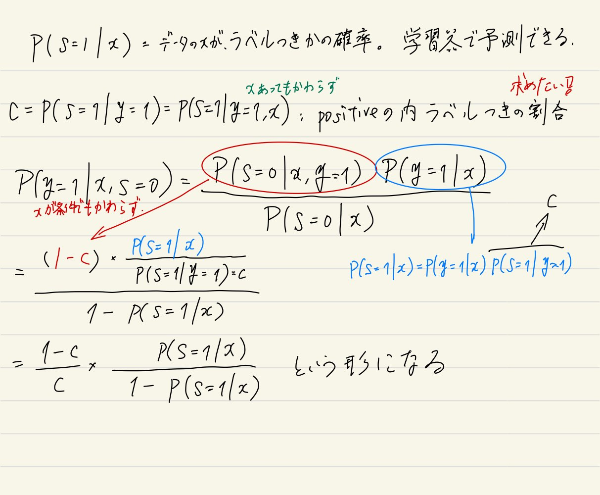

[元論文](https://cseweb.ucsd.edu/~elkan/posonly.pdf)

参考にしたサイトたち

https://mamo3gr.hatenablog.com/entry/2020/11/29/123147

https://speakerdeck.com/hellorusk/pu-positive-unlabeled-learning?slide=3

## 何なの？

ラベルはいっぱいあるけどつけるの間に合わん。普通はPositiveとNegativeにつけられたデータで行うが、PU Learningは**PositiveとUnknownで区分したデータで学習させる**。

生成モデルに基づく半教師付きの手法と違って、分布を仮定する必要はない。

## 先行研究

2008年時点での先行研究としては以下のような方針がある。

- Unlabeledのなかからnegativeっぽいデータを出して、それをもとにPN学習する?
- UnlabeledのままPositiveと何とか学習をする。
  - Unlabeledを軽い負例として扱うやつ？
  - 一部positive、一部negativeだと割り振って学習するやつ？

[2003年の先行研究](https://www.cs.uic.edu/~liub/publications/ICDM-03.pdf)でこのような重みづけのソフトマージンのSVMをやる分類器はある。

$$
\frac{1}{2} || \mathbf{w} || + C_p \sum _{i \in P} z_i + C_U \sum _{j \in U} z_j
$$

この$C_P, C_U$は**経験則で決めるしかない**らしい。この手法をこの論文が**biased-SVM**と提案している。

- $C_U = 0.01, 0.03, 0.05, \cdots, 0.61$
- $\frac{C_P}{C_U} = 10, 20, \cdots, 200$
- **$C_P$に大きく重みを寄せる**。

1クラスSVM(解説は[ここ](https://yuyumoyuyu.com/wp-content/uploads/2021/01/oneclasssupportvectorremachine.pdf)とか[ここ](https://datachemeng.com/wp-content/uploads/oneclasssupportvectormachine.pdf))を使った分類もある。(**negativeを外れ値とみなして外れ値検出**)ただ、ハイパーパラメタにかなり依存してしまうという性質がある。

## 仮定、説明

サンプル$x \in \mathbb{R}$について、
- 正答$y \in 0, 1$があり、**1ならPositive、0ならNegative**である。
- ラベル$s \in 0, 1$があり、**1ならラベルあり、0ならラベルなし**

そして、未知だが$(x, y, s)$に**対する不変の分布がある**とする。

仮定として、Positiveなものしかラベル付けされてない、しかも一部。つまり**NegativeはUnknownである**。$p(s = 1| x, y = 0) = 0$

もう1つ仮定として、ラベル付けされるPositiveは、**Positiveの全体からランダムに選ばれると仮定する**。$p(s = 1 | x, y = 1) = p(s = 1 | y = 1) = 一定値c$。$x$に関係なく、取るという意味。

## シナリオについて

基本的には、ランダムに訓練データは$p(\mathbf{x}, y, s)$の分布から選ばれる(もちろん$p(s = 1 | y = 0) = 0$というのが成り立つ分布)が、$y$の情報を落としてデータとしては$(\mathbf{x}, s)$のみを得る。

今回の場合はsingle-training-setシナリオというものであり、以下の手順で行う。

1. $p(\mathbf{x}, y, s)$の分布から1回、一定数サンプリングする。
2. この中で$s = 1$となる部分をPositiveとする。
3. 残ったすべてをUnlabeledとして扱う。

このサンプリング方法では、一度だけのサンプリングして、そこから$p(s = 1)$は計算できる。つまり、

$$
\exist D \sim p(\mathbf{x}, y, s) \\\\ 
p(\mathbf{x}, y | s = 1) = D \space \mathrm{if \space = 1} \\\\ 
p(\mathbf{x}, y | s = 0) = D - p(\mathbf{x}, y | s = 1)のデータ
$$

一方、case-controlシナリオでは、以下の手順で行う。

1. $p(\mathbf{x}, y, s)$の分布から1回、一定数サンプリングする。
2. この中で$s = 1$となる部分をPositiveとする。
3. 残ったすべてを**捨てる**。
4. $p(\mathbf{x}, y, s)$の分布から**もう1回**、一定数サンプリング(さきほどと同数である必要もない)する。
5. これのすべてをUnlabeledとする。(つまり、single-training-setのように非Positiveなら全部ここに入るわけではない！)

$$
\exist D _1, \exist D _2 \sim p(\mathbf{x}, y, s) \\\\ 
p(\mathbf{x}, y | s = 1) = D _1 \space \mathrm{if \space s = 1} \\\\ 
p(\mathbf{x}, y | s = 0) = D _2
$$

こちらの方が一般的である。ただし、欠点としては2回のサンプリングの母数は同数ではないし、1回目のサンプリングの母数がいくつなのかもわからないことが通例なので、$p(s = 1), p(y = 1)$の推定はそもそもできない。

## 理論的なおはなし

条件付確率の分解をやる。「xであるときにy=1」$p(y = 1 | x)$と「xであって、y=1であるときにs=1」$p(s | x, y = 1)$の積。依存関係はあるが関係はない。

$$
p(s = 1 | x) = p(y = 1, s = 1 | x) = p(y = 1 | x) p (s = 1 | x, y = 1) = p(y = 1 | x) \cdot c
$$

つまり、

$$
p(y = 1 | x) = \frac{p(s = 1 | x)}{c}
$$

つまり、データに対してPositiveである確率は、以下のものがわかる。

1. $p(s = 1 | x)$　　データ$x$に対して、それがラベル付きかどうか。**これは通常の分類器で推定できるので問題なし**。
   1. 実際にやる場合、SVMならば正例の重みを強くして学習する？
   2. 全部のデータと実際のラベル付きデータはあるんで、その分布を仮定する手法ならなんでも。深層学習でもいい。
2. $c = p(s = 1 | y = 1)$　　Positiveなラベルなら、印がつく確率。
3. ついでにいえば、確率なので、$p(s = 1 | x) \leq c = p(s = 1 | y = 1)$である。これは、どのデータにおいても、$p(s = +1 | \mathbf{x})$は実際において真と確定したもののラベルの付く確率以下とわかる。
   1. どのデータも未確定か、確定しても同じ$p(s = 1 | y = 1)$なので。未確定の場合はそもそもNegativeならラベルが付かないことをも考えると妥当。

よって、一番欲しい$p(y = 1 | x)$推定できる。

## Elkan Noto法

やりたいこととしては、$p(s = 1 | \mathbf{x})$を学習できたら、これをcalibrationして$p(y = 1 | \mathbf{x})$にすること。
というわけで、係数の**$c = p(s = 1 | y = 1)$を推定することができれば、勝ちです**。

推定法としては、ちゃんと無限のデータで訓練し、真のモデルで学習できる前提だと3つの手法のいずれも正しい。だが実用上は手法1がいい。

### 手法1

$$
c = p(s = 1 | y = 1) = \frac{p(s = 1 | \mathbf{x})}{p(y = 1 | \mathbf{x})}
$$

全体の中でのある一部のデータセット$(\mathbf{x}, y, s) \in V$があるとする。**この中で$(\mathbf{x}, y = +1, s = +1) \in P$のものだけに着目し、これらの中での印がついてるものの割合を見ればよい**。それが$c = \frac{p(s = 1 | \mathbf{x})}{p(y = 1 | \mathbf{x})}$の割合となれる。

すべての$p(s = 1 | \mathbf{x})$の設計が正しければこれは正しいが、実際は有限の訓練データ、モデルの概形によってうまく行かないのがふつうである。
ただ、**実際で使う分にもこれが一番の精度である**。手法2は分母で分散が更に加わる。手法3は1つの変数、こちらは平均なので分散のブレが小さい。

### 手法2

同様に$V, P$を使って以下のように推定する。

$$
\frac{\sum _{\mathbf{x} \in P} p(s = +1 | \mathbf{x})}{\sum _{\mathbf{x} \in V} p(s = +1 | \mathbf{x})}
$$

これは、同じ基準で測量している以上、分母と分子での和の比がそのまま$V$と$P$の比に近似され、これは$(\mathbf{x}, y, s) \in V, (\mathbf{x}, y = +1, s = +1) \in P$に他ならないからである。

### 手法3

$$
\max _{\mathbf{x} \in V} p(s = 1 | \mathbf{x}) < c = p(s = 1 | y = 1)
$$

$p(s = 1 | y = 1)$が$p(s = 1 | \mathbf{x})$にとっての最大なので、集めてきた$p(s = 1 | \mathbf{x})$が最大のものとすればよい。
$p(s = 1 | \mathbf{x})$はあらかじめ別口で学習させておく。ただ理論上は等号成立するが01損失で学習をしない以上ここら辺は曖昧になりそう？ INTEREST!

### $p(s = 1 | \mathbf{x})$はどう得るんだ

もう1つ重要な部分として、$p(s = 1 | \mathbf{x})$をどのように得るのかというものがある。これは論文によれば、通常の手段で分類器を作るということ。

ただし、SVMなどでの訓練は精度高くないし、NNは明らかにすごく過学習しそうだし、実用的に辛そうだが果たして……。

## 重み付きElkan Noto法

$p(s = 1 | \mathbf{x})$から直接推定するのではなく(だが学習器として$p(s = 1 | \mathbf{x})$はこの手法で使われる)、Unlabeledのデータを重み$w \in [0, 1]$のPositive例と、重み$1 - w$のNegative例の2つとみなして、そこから学習を進める手法。では、重み$w$の推定はどうするか？仮定の$p(y = 1 | \mathbf{x}, s = 1) = 1$を前提に$p(y = 1 | \mathbf{x}, s = 0)$(ラベルなしのPositive例)の式変形を考える。

[理論的なお話](#理論的なおはなし)でもあったように、$c = p(s = 1 | y = 1) = p(s = 1 | \mathbf{x}, y = 1)$が前提であるので、前述の推定によってこれを得るのをやる前提である。
この式変形でひとまず、**UnlabeledであるときののPositiveである確率**を求められた。

次は、データ分布全体$p(\mathbf{x})$にわたる関数h(これはまあ結局損失関数かな？)に対しての期待値を求めてみる。

$$
\mathbb{E} _{(\mathbf{x}, y, s)} [h(\mathbf{x}, y)] = \int _{\mathbf{x}, y, s} h(\mathbf{x}, y) p(\mathbf{x}, y, s) d \mathbf{x} dy ds \\\\ 
= \int _{\mathbf{x}} p(\mathbf{x}) \sum _{s = 0, 1}p(s | \mathbf{x}) \sum _{y = 0, 1}p(y | s, \mathbf{x}) h(\mathbf{x}, y) d \mathbf{x} \\\\ 
= \mathbb{E} _{\mathbf{x}} [ p(s = 0 | \mathbf{x}) p(y = 0 | \mathbf{x}, s = 0) h(\mathbf{x}, 0) + p(s = 0 | \mathbf{x}) p(y = 1 | \mathbf{x}, s = 0) h(\mathbf{x}, 1) \\\\ 
+p(s = 1 | \mathbf{x}) p(y = 0 | \mathbf{x}, s = 1) h(\mathbf{x}, 0) + p(s = 1 | \mathbf{x}) p(y = 1 | \mathbf{x}, s = 1) h(\mathbf{x}, 1) ] \\\\ 
$$

ここで、期待値の中の第3項は$y = 0, s = 1$であるがこれはあり得ないという問題設定なので項を消すことができる。そして、重みを以下のように設定してみると、式をかなり書き換えられる。第4項の$p(y = 1 | \mathbf{x}, s = 1) = 1$は仮定より自明。

$$
w(\mathbf{x}) = p(y = 1 | \mathbf{x}, s = 0) = \frac{1 - c}{c} \frac{p(s = 1 | \mathbf{x})}{1 - p(s = 1 | \mathbf{x})} \\\\ 
\mathrm{第4項:}\mathbb{E} _{\mathbf{x}} [ p(s = 1 | \mathbf{x}) p(y = 1 | \mathbf{x}, s = 1) h(\mathbf{x}, 1) ] 
= \mathbb{E} _{\mathbf{x} | s = 1} [h(\mathbf{x}, 1)] \\\\ 
\mathrm{第1,2項:}\mathbb{E} _{\mathbf{x}} [ p(s = 0 | \mathbf{x}) p(y = 0 | \mathbf{x}, s = 0) h(\mathbf{x}, 0) + p(s = 0 | \mathbf{x}) p(y = 1 | \mathbf{x}, s = 0) h(\mathbf{x}, 1) ] \\\\ 
= \mathbb{E} _{\mathbf{x} | s = 0} [ (1 - w(\mathbf{x})) h(\mathbf{x}, 0) + w(\mathbf{x}) h(\mathbf{x}, 1) ] \\\\ 
\mathbb{E} _{\mathbf{x}, y, s} [h(\mathbf{x}, y)] 
= \mathbb{E} _{\mathbf{x} | s = 1}[ h(\mathbf{x}, 1) ] + \mathbb{E} _{\mathbf{x} | s = 0} [ w(\mathbf{x}) h(\mathbf{x}, 1) + (1 - w(\mathbf{x}), 0)]
$$

このように、**ラベルなしのデータ**は重み$w(\mathbf{x})$のラベルありと重み$1 - w(\mathbf{x})$のラベルなし(**必ずNegativeであることを意味しているわけではない**！)に分割できる。そして、この$h$に損失関数を代入して学習をさせることにより、分類ができるのだ。

まとめると、重み付きElkan Notoは以下の手順を取る。
1. 無印Elkan Notoをまず行う。
   1. $p(s = 1 | \mathbf{x})$の分類器の訓練。
   2. $c = p(s = 1 | y = 1)$の推定。
   3. 無印Elkan Notoならこれらだけで推定をするが、重み付きはこれらの情報を使って新たに損失関数を定義し、それの最適化をする形になる。
2. 上記の通りに損失関数を定義。
3. 学習を行い、得られた分類器は入力例に対して、PositiveかNegativeかを分類できる。

## モデルの出力する確率(calibrated)の正確さ

ロジスティック回帰はそれなりに正しいらしいが、ランダムフォレスト、SVM、ナイーブベイズなどは確率自体それなりに正しくないのでこの手法ではブレてしまうのでは。

### 実際の学習のフェーズ

### 評価

**手法2の方が実験的に精度が良い**。

どっちも、(論文は2だけ離散の分類器は無理らしいけど、全部離散は無理では？？？)分類器が離散だとNGらしい。

また、理論的に正しく境界を決めるには、誤差関数をnon-convex loss(SVMのhinge lossはNG)にしないとならないという難点がある。

