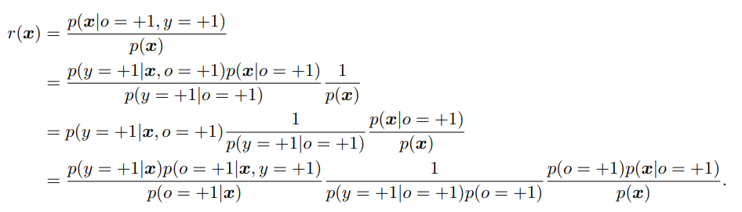
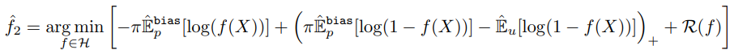

[元論文](https://openreview.net/forum?id=rJzLciCqKm)

# Introduction

case controlシナリオという状況。

- **ラベルありPositiveはラベルなしとは別に抽出される**。
- **ラベルなしは、全データの中から一部だけサンプリング**

この状況では、先行研究によれば、**Positiveがどのようにラベル付けされるのかの仮定なくして、分類器を特定できない**。なので、今までは**完全にランダムに一様に選んだ＝Positiveのラベル付きとラベルなしは皆同じ分布に従う**としている。

だが、現実ではそうはならんやろ、の例がどんどん多い。**selection bias=選択バイアスが存在**する。

今までも対策があったが他の謎制約をつけることが条件だった。

ここでは、**同じ$\mathbf{x}$に対して、$p(o = +1 | \mathbf{x}, y = +1)$が高ければ、$p(y=+1 | \mathbf{x})$も高くなる**。これは以下のような**典型的なselection biasがある例でも、絶対に成り立つ**。

## Anomaly Detectionの例

ラベル付けされてないデータセットから、anomaly=異常値を検出する。ここで、異常値データが収集されるとき、データが異常であればあるほど、ラベル付けされる可能性が高くなる。つまり、**同じanomalyの中でも、一様にランダムでラベル付けされてるわけではない**！

## 顔認識の例

Positiveが明確に誰誰とわかる顔、Unlavelingが誰なのかが不明な顔。この時、例えPositiveであるものでも、はっきりと顔が映るのがPositiveで、ぼんやりならUnlavelingにされてしまう。

# 選択バイアスがあるPU Learningでの問題設定

$\mathbf{x} \in \chi \subset \mathbb{R}^d$と学習データを定義し、それぞれ$y \in -1, +1$のラベルを持つ二値分類である。$o \in 0, +1$はラベルがない=0、ある=1。先人に従い、$p(\mathbf{x}, y, o)$という未知の分布が存在するとする。

サンプリングスキームには、censorシナリオ=one sampleとcase-controlシナリオ=two samplesがある。

## Censorシナリオ

censorシナリオでは、**ラベル付け候補データは(当然Positive, Negative関係なく)周辺確率分布$p(\mathbf{x})$に従いまず選ばれ**、

- Positiveならば、$p(o=+1 | \mathbf{x}, y = +1)$の確率でラベルをつける。
- Negativeならば、前提条件として$p(o=+1 | \mathbf{x},  y = -1) = 0$なので、ラベルをつけない。

## Case-Controlシナリオ

case-controlシナリオでは、**Positiveのデータは条件付き分布$p(\mathbf{x} | y=+1)$から選ばれ、ラベルなしのデータは周辺確率分布$p(\mathbf{x})$から選ばれる**。

こっちの方がわずかに一般的らしい。Case-Controlシナリオは、$p(\mathbf{x}), p(\mathbf{x} | o = +1)$によって生成されたサンプルへのアクセスを仮定するが、Censorシナリオは、$p(\mathbf{x}), p(\mathbf{x} | o = 0), p(\mathbf{x} | o = +1)$を仮定するから大変らしい。 ここらへんあんまり理解できなかった...

## 本筋

ということで、case controlシナリオに絞ると。

- Positiveのデータセット$[\mathbf{x}_i] _{i = 1}^{n}$　$p(\mathbf{x} | y = +1, o = +1)$　**ラベル付き(当然Positiveである)という条件での$\mathbf{x}$の分布に従って取得**。
- Unlabelingのデータセット$[\mathbf{x ^\prime}_i] _{i = 1}^{n ^{\prime}}$　$p(\mathbf{x})$　**PNやラベル情報関係なく、取得**。

ここで、「完全にランダムに選ぶ」ことを仮定してないことに注意。なので、$p(\mathbf{x} | y = +1)$は$p(\mathbf{x} | y + 1, o = +1)$と**完全に一致するわけではない**。これが違うとき、それこそが**選択バイアス**である。

注 by me. $p(\mathbf{x} | y = +1)$は、Positiveのデータの分布。$p(\mathbf{x} | y = +1, o = +1)$は、Positiveのうち、ラベルがついてる時のデータの分布。これが異なるということは、**まさにラベル付けされたPositiveと全体のPositiveの分布が違ってバイアスがある**こと。

$\pi = p(y = +1)$、つまりPositiveである確率は**クラス事前確率**というらしい。**この$\pi$は既知である**前提でいく。定め方はそれなりに色々あるが、この問題設定では、**クラス事前確率を理論的に保障しながら推定はできないらしい**。

でも、大丈夫。分からないとしてもアルゴリズムをマイナーチェンジをするだけで済む。

つまり、「完全にランダムに選ぶ」という仮定から弱めた条件の下でちゃんと学習できるよ、と示してみた。

# 特定戦略

[2008年のPU Learningの初リリース](../pu-learning/index.html)時、仮定なしにPとUのデータからだけで$p(y = +1 | \mathbf{x})$を得ることができなかった。なぜなら、真っ先に$p(o = 1 | \mathbf{x}, y = 1) = p(o = 1 | y = 1) = 定数c$と、$\mathbf{x}$関係なく一定確率でPositiveならラベル付けしてた、と仮定したからだ。よく読めばその後の$g(\mathbf{x})$の推定は思いっきりこの仮定使ってる。

Case-Controlシナリオでは、「完全にランダムに選ぶ」と仮定なら、$p(\mathbf{x} | y = +1, o = 0) = p(\mathbf{x}, y = +1, o = +1)$が成り立つ(上の段落の式の別表示ともいえるね)。この時、以下のように$p(y = + 1 | \mathbf{x})$を推定できた。

$$
p(y = + 1 | \mathbf{x}) = \frac{p(\mathbf{x}, y = +1)}{p(\mathbf{x})} = \frac{p(\mathbf{x} | y = +1) \pi}{p(\mathbf{x})}
$$

$$
= \frac{ p(\mathbf{x} | y = +1, o = +1) \pi}{p(\mathbf{x})}
$$

そして、ここの等式が、仮説$p(o = 1 | \mathbf{x}, y = 1) = p(o = 1 | y = 1) = 定数c$、「完全にランダムに選ぶ」が使われて式変形してるところ。ここまで変形したかたちなら、入力から不変推定量で推定できる。

というわけで、我々は$p(y = +1 | \mathbf{x})$自体を推定する代わりに、$p(y = +1 | \mathbf{x})$からいくつかの情報を抽出して分類器を学習させよう。これは[Partial Identificationと呼ばれている。(Manski, 2008？)](https://link.springer.com/book/10.1007/b97478)

この研究では、以下のような仮定に**弱めてみる**。

任意の$\mathbf{x} _i, \mathbf{x} _j \in \chi$で、

$$
p(y = +1 | \mathbf{x} _i) \leq p(y = +1 | \mathbf{x} _j) \Leftrightarrow p(o = +1 | \mathbf{x} _i) \leq p(o = +1 | \mathbf{x} _j)
$$

**元々は、両辺はイコールじゃないとあかんかった**。この条件は、**$\mathbf{x} _i$が$\mathbf{x} _j$よりもPositiveっぽくないなら、$\mathbf{x} _i$の方が、$\mathbf{x} _j$よりも、ラベル付けされるっぽくない**。

これでは、リスク関数の不変推定量を経験的にデータから作れないが、それでもやってみたわ。

これ、普通の仮説じゃね？弱いかいうほど？こんな仮説でも許せばいいんだ？ by me

# Partial Identificationと分類の戦略

前述のとおり、選択バイアスがあるときは$\pi$が与えられようが、$p(y = +1 | \mathbf{x})$は推定できない。

以下の定理1が成り立つ。

$$
r(\mathbf{x}) = \frac{p(\mathbf{x} | y = +1, o = +1)}{p(\mathbf{x})}
$$

$$
p(y = +1 | \mathbf{x} _i) \leq p(y = +1 | \mathbf{x} _j) \Leftrightarrow r(\mathbf{x} _i) \leq r(\mathbf{x} _j)
$$

## 定理1の証明

注: $p(a|b)$の時、$b$は全ての項についてるおまけみたいなもんだから、それ以外で見て判断していく。

$$
p(o = +1 | \mathbf{x}) = \sum _{y \in -1, 1} p(o = +1, y | \mathbf{x})
$$

周辺確率分布に展開する。

$$
= p(o = +1 | \mathbf{x}, y = +1)p(y = +1 | \mathbf{x}) + p(o = +1 | \mathbf{x}, y = -1)p(y = -1 | \mathbf{x})
$$

$p(o = +1 | \mathbf{x}, y = -1) = 0$というのがPU Learningなので、式は以下のように簡約できる。この時、本来ならば上のように全パターンの可能性を網羅しないといけない。

$$
p(o = +1 | \mathbf{x}) = p(o = +1 | \mathbf{x}, y = +1)p(y = +1 | \mathbf{x})
$$

次に$r(\mathbf{x})$について

- 2行目ではベイズの定理で変形を考えてみてる。
- 4行目では、
  - 第1項
    - 分子は$p(y = +1 | \mathbf{x}) p(o = +1 | \mathbf{x}, y = +1) = p(o = +1, y = +1 | \mathbf{x})$　$\mathbf{x}$を隠すと、条件付確率の定義の式そのもの。
    - 分母と第3行目第1項の積は$p(o = +1 | \mathbf{x}) p(y = +1 | \mathbf{x}, o = +1) = p(y = +1, o = +1 | \mathbf{x})$となる。　上の式と同じなので、確かに同値変形。
  - 第2項と第3項では、それぞれ分子分母に$p(o = +1)$をかけている。

ここで、先ほどの$p(o = +1 | \mathbf{x}) = p(o = +1 | \mathbf{x}, y = +1)p(y = +1 | \mathbf{x})$を使うと、**第1項は1となり**、第2項も$p(y = +1, o = +1)$となり、第3項も$p(\mathbf{x}, o = +1)$となる。つまり、

$$
r(\mathbf{x}) = \frac{p(\mathbf{x}, o = +1)}{p(y = +1, o = +1)p(\mathbf{x})} = \frac{p(o = +1 | \mathbf{x})}{p(y = +1, o = +1)}
$$

ここで、$C=p(y = +1, o = +1)$とすると($\mathbf{x}$について、これは変数ではないので)まさに$r(\mathbf{x}) = C p(\mathbf{x}, o = +1)$　これはまさに仮定

$$
p(y = +1 | \mathbf{x} _i) \leq p(y = +1 | \mathbf{x} _j) \Leftrightarrow p(o = +1 | \mathbf{x} _i) \leq p(o = +1 | \mathbf{x} _j)
$$

そのもの。

## 本筋

$$
r(\mathbf{x}) = \frac{p(\mathbf{x} | y = +1, o = +1)}{p(\mathbf{x})}
$$

$$
p(y = +1 | \mathbf{x} _i) \leq p(y = +1 | \mathbf{x} _j) \Leftrightarrow r(\mathbf{x} _i) \leq r(\mathbf{x} _j)
$$

ともあれ、以上が成り立つ。

このことは、$p(y = +1 | \mathbf{x} _i)$を我々が推測できずとも、**右辺の$r(\mathbf{x})$で順序が正しいので、右辺の推測ができれば、左辺もある程度は不等式で挟み込める**、ということ。

そして、ここで$r$は経験的にデータから得られるので、$\theta \in \mathbb{R}$として、

$$
h(x) = sign(r(\mathbf{x}) - \theta)
$$

この$h(\mathbf{x})$こそが、**識別器そのもの**。必要十分になってる不等式は、$p(y = +1 | \mathbf{x})$について、つまり**我々が一番欲しかったもの**。

$\theta$の決め方として、以下の$\theta _{\pi}$がおすすめ。

$$
\pi = p(y = +1) = \int p(\mathbf{x}) d \mathbf{x} 積分する区間ではr(\mathbf{x}) \geq \theta _{\pi}
$$

ちょうどすべての条件を満たす$r(\mathbf{x})$についての期待値が、全体でのPositiveの割合になるように、上手く$\theta _{\pi}$にするのが理想的。

## precisionとrecall

[ここの記事](https://qiita.com/K5K/items/5da52e99861483cae876)で解説がある。

- precisionは$\frac{TP}{TP + FP}$　Positiveと言ったもののうち、本当にPositiveの割合。
- recallは$\frac{TP}{TP + FN}$　結果的にPositiveの量に対して、どれだけ正し買ったかの割合。

我々は**$h(\mathbf{x}) = r(\mathbf{x}) - \theta$の$\theta = \theta _{\pi}$とすれば、precision=recallとなる**、と証明できる。証明略。

# 提案したアルゴリズム

ここまでの話をまとめると、$p(y = +1 | \mathbf{x})$を予測するのは、選択バイアスがあると仮定するなら無理だが、代わりに不等式で同様に比較できる$r(\mathbf{x}) = \frac{p(\mathbf{x} | y = +1, o = +1)}{p(\mathbf{x})}$を、不変推定量からいい感じに得たい。流れとしては以下の感じ。

1. 入力
   1. Positiveのデータセット$[\mathbf{x} _i] _{i = 1} ^ {n}$
   2. Negativeのデータセット$[\mathbf{x} ^{\prime}_i] _{i = 1} ^ {n^{\prime}}$
   3. Negativeのデータセット$[\mathbf{x} ^{test}_i] _{i = 1} ^ {n^{test}}$
   4. Positiveの割合$p(y = +1) = \pi$　これは小規模なデータセットからの平均を不変推定量として推定できる。
2. $[\mathbf{x} _i] _{i = 1} ^ {n}$と$[\mathbf{x} ^{\prime}_i] _{i = 1} ^ {n^{\prime}}$を使って、分類器$f(\mathbf{x})$を学習して、$r(\mathbf{x})$を作る。最も、実際は経験的に不変推定量から$\hat{r}(\mathbf{x})$を作るけど。
3. $\hat{r}(\mathbf{x})$から、$\theta_{\pi}$を作る。最も以下略で$\hat{\theta_{\pi}}$だが。
4. $\hat{r}(\mathbf{x}), \hat{\theta_{\pi}}$から、$h(\mathbf{x})$を作り、これを識別器にする。

以下では、この各ステップについてどのように推定するのかを書く。

## 選択バイアスがないと仮定したリスク関数の最小化と

**選択バイアスがある**と考えてるわけだが、この場合はリスク関数を上手く表現できないとのこと。仕方がないので、選択バイアスがないパターンのリスク関数を表す。これは[2015のdu Plessisら](https://proceedings.mlr.press/v37/plessis15.html)

なお、ここで$\mathbf{x}$ではなく$X$なのは、複数のベクトルをまとめて扱った和として考えていいだろう。

$$
R(f) = \pi \mathbb{E} _{p(\mathbf{x} | y = +1)} [l(f(X), y = +1) - l(f(X), y = -1)] + \mathbb{E} _{p(\mathbf{x})} [ l(f(X), y = -1) ]
$$

ここで、選択バイアスが働いてるので、$p(\mathbf{x} | y = +1)$について期待値を求めてる上式は使えない。我々は$p(\mathbf{x} | y = +1, o = +1)$しか知らないからだ。だが、**ここでも、仕方ないとして知ってる要素入れ替えたものを、ここでつかおう**。

$$
R(f)^{bias} = \pi \mathbb{E} _{p(\mathbf{x} | y = +1, o = +1)} [l(f(X), y = +1) - l(f(X), y = -1)] + \mathbb{E} _{p(\mathbf{x})} [ l(f(X), y = -1) ]
$$

ここで、損失関数としてはこの論文では

$$
l(m, y = +1) = -\log f(\mathbf{x}), l(m, y = -1) = -\log f(1 - f(\mathbf{x}))
$$

としている。これを代入すると、以下のかたちに。これを使ってるみたい。

$$
R(f)^{bias} = \pi \mathbb{E} _{p(\mathbf{x} | y = +1, o = +1)} [-\log f(X) + \log (1 - f(X))] + \mathbb{E} _{p(\mathbf{x})} [ \log (1 - f(X)) ]
$$

性能評価のところは一旦割愛や...

実際のところ、最小化を考えるにあたり、以下のように正則化項$R(f)$をつけてる。

du Plessisらはこの式を経験的にやっても不偏推定量なので真の分類器の損失関数へと近づくと2015年示した(まだ読んでない)。

だが[2017のKiryoら](https://arxiv.org/abs/1703.00593)が示した通り、Deep Neural Networkでは上の式はあまり使えないとのこと。なぜなら、**DNNのような表現能力が高すぎるネットワークでは過学習をするらしい。マイナスになる項を際限なくマイナスにしちゃうらしい**。具体的には、$\log(1 - f(X))$で、$f(X)$を$1 - \epsilon$にいくらでも近づけることになり、マイナスへ無限に行っちゃうのだ。

だから、以下のように$\log(1 - f(X))$の部分で$\max(0, \cdot)$という操作を加えて常に正にする正規化？をしている。

そして、$r()$

## $r(\mathbf{x})$の推定

$$
r(\mathbf{x}) = \frac{p(\mathbf{x} | y = +1, o = +1)}{p(\mathbf{x})}
$$

これを得たい。これに関しては、2012年Sugiyamaらが方法をまとめている。最小二乗法を使ったLeast-squares importance fittingを使おう。数学的にも解析しやすいからね。

まず、$s : \chi \to \mathbb{R} ^{+}$を考え、$s \in S$とする。この$s$を上手いこと選んで、$r(\mathbf{x})$に近づけるようにする。

$$
R_{DR}(s) = \mathbb{E} _{p(\mathbf{x})} [ (s(X) - r(X))^2 ]
$$

$$
= \mathbb{E} _{p(\mathbf{x})} [ s(X)^2 + r(X)^2 ] - 2 \mathbb{E} _{p(\mathbf{x})} [ s(X)r(X) ]
$$

ここで、2つ目の項は

$$
\int s(X)r(X) p(\mathbf{x}) d\mathbf{x} = \int s(X) \frac{p(\mathbf{x} | y = +1, o = +1)}{p(\mathbf{x})}p(\mathbf{x}) d\mathbf{x} 
$$

$$
= \int s(X) p(\mathbf{x} | y = +1, o = +1) d\mathbf{x} = \mathbb{E} _{p(\mathbf{x} | y = +1, o = +1)} [s(X)]
$$

これを使うと、

$$
R_{DR}(s) = \mathbb{E} _{p(\mathbf{x})} [ s(X)^2 + r(X)^2 ] - 2 \mathbb{E} _{p(\mathbf{x} | y = +1, o = +1)} [s(X)]
$$

この式を最小化する。この時、$\mathbb{E} _{p(\mathbf{x})} [ r(X)^2 ]$は定数とみなせるので、考えなくていい。実際に何かは知らないが、$s(X)$決める上ではどうしようもないからな。つまり、

$$
\hat{r}(\mathbf{x}) = \min _{s \in S} \frac{1}{2} \mathbb{E} _{p(\mathbf{x})} [ s(X)^2] - \mathbb{E} _{p(\mathbf{x} | y = +1, o = +1)} [s(X)]
$$

## $\theta _{\pi}$の推測

$$
\pi = p(y = +1) = \int p(\mathbf{x}) d \mathbf{x} 積分する区間ではr(\mathbf{x}) \geq \theta _{\pi}
$$

上式が、$\theta _{\pi}$の定義だった。$p(\mathbf{x})$に従うテストデータの$[\mathbf{x} ^{test}_i] _{i = 1} ^ {n^{test}}$を使って、経験的に推定すると、以下の式を満たす$\theta _{\pi}$が得られる。

$$
n^{test} \pi = \sum _{i = 1}^{n^{test}} 1(\mathrm{if} \hat{r}(\mathbf{x} _i) \geq \hat{\theta _{\pi}})
$$

これの決定自体は上の式に従えばいいが、明らかに単調性があるので実際は二分探索をすればいいね。

# 実験

実験では、SVMで$s(\mathbf{x})$もとい$\hat{r}(\mathbf{x})$を作った。つまり、

$$
s(\mathbf{x}) = \mathbf{w} ^ T \mathbf{\Phi}(\mathbf{x})
$$

このように識別器を定義できた。$\Phi$はいつも通り、基底の変換やね。カーネル関数はガウシアンカーネルを使った。つまり、

$$
\mathbf{\Phi} _{l} (\mathbf{x}) = \exp (- || \mathbf{x} - \mathbf{c}_l ||^2 / 2 \sigma^2)
$$

ただし、$\mathbf{c}_l$は、$\mathbf{x}_i, \mathbf{x ^{\prime}} _i$のすべて。

そして、識別関数の$f(\mathbf{x})$自体は以下のようにシグモイド関数で定めてみた。(これそもそも$s(\mathbf{x})$がわかってるのに、わざわざこれを求める意味ある？)

おわり