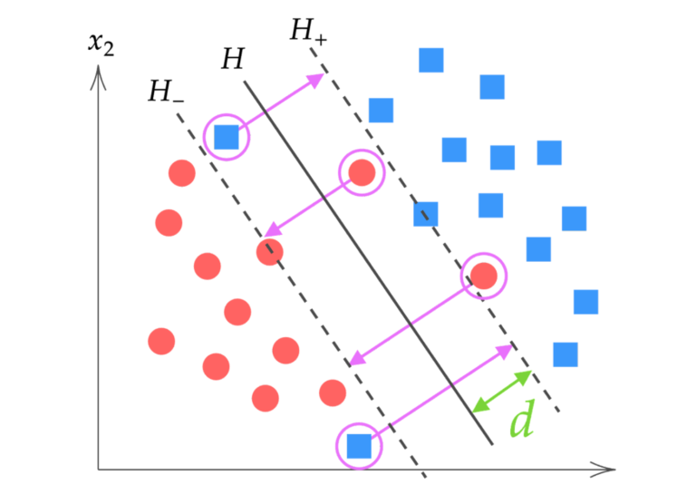
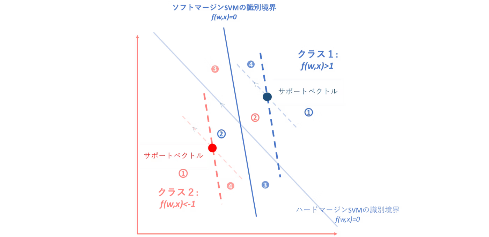

[こっちのQiitaはわかりやすい](https://qiita.com/sakigakeman/items/f93551d8bbfe3034692d)。

[こっちのブログ](https://laid-back-scientist.com/soft-svm-theory)も補助として見た。

[誤差項はやっぱΣらしい](https://home.hiroshima-u.ac.jp/tkurita/lecture/svm/node5.html)。

# ソフトマージン

$$
\min_{\mathbf{w, \theta}} || \mathbf{w} ||
$$

$$
条件：y_i(\mathbf{w}^T \mathbf{x_i} + \mathbf{\theta})  \geq 0
$$

ハードマージンは、完全に分割できる超平面じゃないとアカン、というところだった。しかし、ソフトマージンでは、**教師データに誤分類が入ることに対してもOKとするけど、代わりにペナルティを与える**というもの。

上のように多少のズレでも許す。

$$
\min_{\mathbf{w, \theta}} \lambda || \mathbf{w} || + \sum _{i = 1} ^ {n} L(\mathbf{y_i}, f(\mathbf{w}, \mathbf{x}_i))
$$

$$
条件1: y_i(\mathbf{w}^T \mathbf{x_i} + \mathbf{\theta})  \geq 1 - L(y_i, f(\mathbf{w}, x_i))
$$

$$
条件2: L(y_i, f(\mathbf{w}, x_i)) \geq 0
$$

$\lambda || \mathbf{w} ||$は正則化項、$\sum _{i = 1} ^ {n} L(\mathbf{y_i}, f(\mathbf{w}, \mathbf{x}_i)$は、誤差項。
学習で誤差項を合わせる感じだけど、誤差にあまりに過学習させないように、当初の$|| \mathbf{w} ||$が存在する。

## 損失関数

では、損失関数$L$についてどうするのか、ということになる。

**一番雑なのは、成功なら0、失敗したら1、という0-1損失関数**。だけど、これではギリギリ成功、余裕を持って失敗と切り分けることはできない。
また、ハードマージンと同様、実際の最適解を求めるには、**勾配法でやるので、微分可能が勿論望ましい**。

このうち、

- ①は、ハードもソフトも分類できてるもの。これ考えなくていい。
- ②は、ハードもソフトも分類できてないもの。
- ③は、ハードでは誤分類だが、ソフトで改善される。
- ④は、ハードもソフトも分類できるが、ソフトではマージン内(なくてもセーフだが)。サポートベクトルじゃないのに...

2から4まで考える必要がある。これを満たすのは、ヒンジ損失関数というもの。

$$
\max (0, 1 - y_i(\mathbf{w}^T \mathbf{x}_i + \mathbf{\theta}))
$$

これを求めるのは例によって勾配法。虹計画法や確率的勾配降下法を使う。

