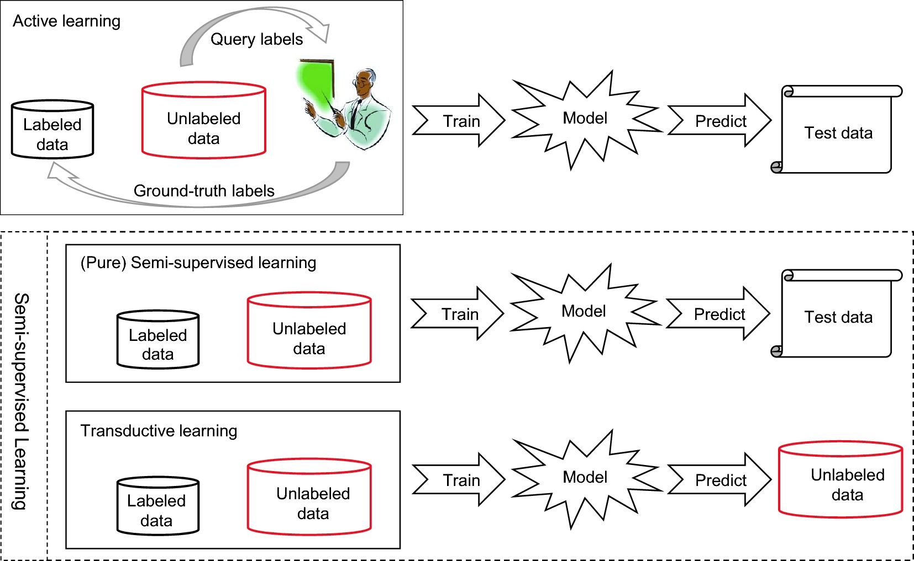

[元論文](https://academic.oup.com/nsr/article/5/1/44/4093912)

# Introduction

Weakly Supervised Learningでは3つの分野がある。

- Incomplete Supervision　　**学習データの一部にだけラベルがあって、他にない**。これ、Semi Supervised Learningでは？？？
  - 大量の写真は集められるけど、アノテーションのコストもあって、一部しかアノテーションできないやつ。
- Inexact Supervision　　**ラベル付けの粒度が荒く、細かい粒度のラベル付けはできない**。
  - 画像内の各オブジェクトについて、
- Inaccurate Supervision　　**アノテーションにに一部間違いを混入されている**

実際、これらは並列して起こることもよくある。簡単のため、この記事では二値分類を考える。

# Incomplete Supervision

**学習データの一部にだけラベルがあって、他にない**問題。これ、Semi Incomplete Supervisionと混同してないか？

定式化すると、$f : X \to Y$の学習器で、データセットが$D$であり、(l+1のindexは間違えて表記してるが、l+1番目であるという意味)

$$
D = \{(\mathbf{x}_1, y_1), (\mathbf{x}_2, y_2), \cdots, (\mathbf{x}_l, y_l), \mathbf{x}_l+1, \cdots, \mathbf{x}_m\}
$$

つまり、$l$個のアノテーション済と、$m - l$個のラベルなしがある状態。

これを解決するテクは2つ。違いは下図。

## Active Learning

専門家(人間)が、**ラベル付けされてないうち、重要なデータ=(これがわかれば性能上がるぞ～～～のデータ)のみにラベルをつけて学習データにいれていく**。

  - どういうものがいいかは、[このスライド](https://www.slideshare.net/shuyo/introduction-to-active-learning-25787487)が参考になる。以下が基準の例。
    - 情報量(不確かさ)をいかに減らせるか
      - Uncertainty Sampling, Query-by-Committee
      - 欠点は、**不安定なことと、Queryを出すべきものを選ぶのが難しい**ところ。情報量の計算は大変なんよ。
    - 入力パターンをいかにうまく減らせるか
    - clustering methodでclusterを作ってそこから推測ってね。**欠点は、Clusteringの結果に全依存しちゃう**こと。
  - 上の2つのハイブリッドもある。
  - コストは、OracleにQueryを出す回数そのものなので、これをいかに減らせるか。

データをうまく分類する仮説が存在してるなら、指数のオーダーで改善されていくという結果もある(元の13，14参考)。そういう仮説がないなら、active learningの下限はpassive learningの上限と一致するらしい。あまり役に立たないというのを示してるらしい。

なお、困難なケースでも、**Active Learningは繊細な設計に役に立つ**らしい。

## Semi-Supervised Learning

**少ないデータでまず分類器を学習**させる。その分類器で**高い確信度の結果を正しい結果と判定し、自動的にラベル付けをして、本番の学習データとして使っていく**。

  - 微妙だと判断されたやつはつかわなければよし。
  - 人間が介在しない。全自動化されてる。
  - 一種として、transductive learningというのがある。
    - Bootstrapのように、今ある訓練データで学習器作って、ラベルなしのなかで確信度高いものにラベルをつける。→それを訓練データとして取り込んでもう1回学習器をつくる。という流れを何回も回す。

[このサイト](https://qiita.com/cvusk/items/f411dadd0e464b7d5471)を参考にした。

## 人の手が介在するやり方

データが$n$クラスを代表する$n$個の混合ガウス分布が、それぞれ$a_i$の確率を持っているとする。

$$
f(\mathbf{x} | \mathbf{\theta}) = \sum \limits _{j = 1}^{n} a_j f(\mathbf{x}, \theta_j)
$$

そして、我々は特徴量をのベクトル$\mathbf{x}_i$と、仮定した混合ガウスモデルの$g_i$から、最終的な予測ラベル$y_i$を得たい。

$$
h(\mathbf{x}_i) = \argmax \limits _{c \in \{Y, N\}} \sum \limits _{j = 1}^{n} P(y_i = c | g_i = j, \mathbf{x}_i) P(g_i | \mathbf{x}_i)
$$

$$
P(g_i = j | {\mathbf{x}}_i ) = \frac{\alpha _j f({\mathbf{x}}_i | \theta _j)}{\sum \nolimits _{k=1}^{n} \alpha _k f({\boldsymbol x}_i | \theta _k) }.
$$

これは、i番目の特徴量ベクトルと

普通に判断はできないが、

クラスター推測：データは出てきた元集団があり、そこからの抽出したデータは近傍に集まる。

手法は以下の4つが有名。

### Generative Method

ラベル付けされたものとされてないものは、**似てるなら同じクラスに属する**と判断する方法。EMアルゴリズムで推定できるらしい。

高い精度を出すには、いい生成モデルを使う必要がある。

### Graph-based Method

頂点が各データ、辺がそれぞれの関係(往々にして近さ)のグラフを作る。そして、例えば最小カットで2つに切り分けたサブグラフの中が同じクラスだと判定していく。(他にも手法ある)

高い精度を出すには、いい感じにグラフを作る必要がある。また、明らかにこれは完全グラフを作るのでデータ量が増えるとこれは非現実的手法となる。

## Low-density Separation Method

分離境界をデータ空間上の低密度な所にする、という手法。Semi-supervised Support Vector Machineが有名。

### Disagreement-based Method

複数人の学習者を作り、協力してラベル付けをしていく。学習者のラベル付けの不一致が重要。

1回の試行で、ラベル付けしてないデータから、**それぞれが最も信頼できるものを選んで、その予測したラベルを正解として、自分以外の相手に渡して学習させる**。こうやって何回も試行を繰り返す。これだとアンサンブル学習にもなるので効果も上がるっていうね。

## 落とし穴

基本的にデータ量を増やせばガバガバアノテーションでもそこそこ正しいなら精度上がるが、**逆に精度が下がることもある**。

**半教師あり学習を使う時は、分類器の最悪の場合の性能をよくする=下振れを減らしたいとき**。

# Inexact supervision

**ラベル付けの粒度が荒く、細かい粒度のラベル付けはできない**。例えば、**車とラベル付けした写真だが、車だけトリミングしたわけではなく**、背景として道路標識、建物、信号、通行人なども移りこんでる。これを利用していくこと。

$$
f: X \to Y, D = \{ (X_i, y_i) \}
$$

各$X_i$は、**いろんな情報の詰め込みの集合**になり、$X_i = \{\mathbf{x}_{i, 1}, \cdots, \mathbf{x}_im_i \}$。$m_i$は添え字。これはつまり、$X_i = \{ 道路標識, 車, 信号, 通行人, 建物 \}$のように。

Tweetみたいな雑多なものが色々混入するものとの相性は良さそうね。 by me. 他にも、画像処理、テキスト分類、スパム検出、医療診断、物体検出etcに応用できる。

多くのマルチインスタンス学習のアルゴリズムがある。集合の中の決定の鍵となるアイテム(たち)を見つける研究もある。

ただし、**集合内の各アイテムが異なるルールで分類されるケースだと学習はうまくいかないらしい**。

[2021の新しいやつ論文もある](https://arxiv.org/abs/2106.04716)。Labeled Data Generation with Inexact Supervision. 

[2020の新しめの論文その2](https://qiita.com/k43175695/items/6a86eb83db994f57fc8d)で、日本語の解説。数式多め。

# Inaccurate Supervision

**アノテーションにに一部間違いを混入されている**。

よくあるのが、ラベルノイズ。間違ったラベル付けを修正していくことをやっていく感じ。

一例として、data-editing approachはグラフを作る。各点の**近傍にある点**に対して、**異なるラベルを持つなら2つのノードを辺で結び、重みを与える**。明らかに、まわりと距離近いのに違う！と判定されてるのは特異点か、ラベル付けミス。この場合、その点を学習データから削除するかラベルを変更することになる。ただ。高次元空間では信頼性低いし、疎空間の場合そもそも意味がない。

クラウドソーシングでアノテーションの外注でも、間違いを混入される可能性がかなり高い。ワーカの質とタスクの難易度をモデル化できれば、アノテーションの質も高くなる。2017現在でEMアルゴリズムで確率モデルを作る研究がある。

ただ、**ラベルの質よりも、学習したモデルの性能の方が大事**みたい。つまりアノテーションの質に関して四の五の言う意味はないです。ここらへん中本くん成田くんの発表やね。

ただ、**アノテーションするとき、Unsureは付け加えるべき**。自信のないアノテーションが回避できるようにしないと。実際これで性能は上がる結果が研究にある。double or nothingの方法でやると、自信があるタスクだけつけさせることができる。

# 結論

**上述の3つは組み合わせることができるよ**！

他にも、time-delayed supervisionという強化学習での問題とかもこれの一種。

また、二値分類に注目したが、複数クラス分類や回帰問題にもこれは同じように反映できる。マルチクラスへの割り当てができる問題だと、更に難易度が上がる。