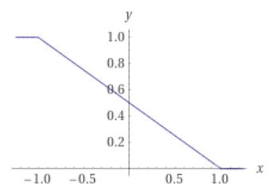

[元論文](https://arxiv.org/abs/1605.06955)

[参考資料](https://cympfh.cc/paper/PNU)　これありがたすぎる。

# Introduction

[既存のPU学習](../pu-learning/index.html)では、一定の分布に従ってデータがあり、そこから偏らずに抽出した、という仮定が必要だった。
例えば[Manifold仮説によれば、低次元のManifoldにデータが分布してる](https://www.jmlr.org/papers/volume7/belkin06a/belkin06a.pdf)という。
現在、分布の仮説が正規化項？になって学習をいい方向にもっていくというかたちだ。だが、**分布の仮説が違うなら、弱教師付き学習の結果が間違ったことになるので、やらない方がマシという結論**になる。結果の裏付けもある。

[2014年のPU学習の分析](../分布仮定不要pu-learning2014/index.html)では、分布の仮定なしにもちゃんと性能は出ると示した。

また、[2016年の研究](https://arxiv.org/abs/1603.03130)で、PU LearningははっきりとPositiveとNegativeがわかるものを凌駕する場合もあることを考証し、それの条件を突き止めた。

こんな中で、Positive、Negative、Unknown、全部混ぜ混ぜにしてみたのがこの研究。

# 背景

## 問題の設定

$\mathbf{x} \in \mathbb{R}^n, y \in \{+1, -1\}$。データはこのような二値分類のタスク。これらは、$p(\mathbf{x}, y)$の分布に従う(そういう分布があるという前提)。

また、

- $p_P(\mathbf{x}) := p(\mathbf{x}|y = +1)$　これはPositiveのデータの分布。これに従った$n$個の独立なデータの集合を$\Chi_P$とする。
- 同様に、$p_N(\mathbf{x}) := p(\mathbf{x}|y = -1)$　これはNegativeのデータの分布。これに従った$n$個の独立なデータの集合を$\Chi_N$とする。
- ラベルなしは、$p(\mathbf{x}) := p(y = +1) p_P(\mathbf{x}) + p(y = -1) p_N(\mathbf{x})$に従う。これに従った$n$個の独立なデータの集合を$\Chi_U$とする。
  - なお、$p(y = +1) + p(y = -1)=1$はもちろん成り立つ。二値分類なので。

次に、
- $g := \mathbb{R}^d \to \mathbb{R}$という決定関数を考える。
  - **符合が正ならPositive、それ以外ならNegativeとする**。
- $l := \mathbb{R} \to \mathbb{R}$という損失関数を考える。
  - $m = y g(\mathbf{x})$の広い$m$で、$l(m)$は小さい値を取る*、という性質を持つ。
    - つまり、**損失関数は0に近い部分(判別しづらいと思われてるもの)以外は、小さい値=誤差小さいと判定される**。　これまじ？わからんけど・

そして、損失関数から、**リスク関数**を定義する。$R_P(g) := \mathbb{E}_{P_p}[l(g(\mathbf{x}))]$　　$p_P(\mathbf{x})$=Positiveのデータの分布においての取り得る$\mathbf{x}$についての、損失関数の期待値。。

- $R_P(g) := \mathbb{E}_{p_P}[l(g(\mathbf{x}))]$　　$p_P(\mathbf{x})$=**Positiveのデータ**の分布においての取り得る$\mathbf{x}$についての、損失関数の期待値。
- $R_N(g) := \mathbb{E}_{p_N}[l(-g(\mathbf{x}))]$　　$p_P(\mathbf{x})$=**Negativeのデータ**の分布においての取り得る$\mathbf{x}$についての、損失関数の期待値。
- $R_{U, P}(g) := \mathbb{E}_{p_U}[l(g(\mathbf{x}))]$　　$p_P(\mathbf{x})$**=Unknownのデータ**の分布においての取り得る$\mathbf{x}$についての、損失関数の期待値。
- $R_{U, N}(g) := \mathbb{E}_{p_U}[l(-g(\mathbf{x}))]$　　$p_P(\mathbf{x})$**=Unknownのデータ**の分布においての取り得る$\mathbf{x}$についての、損失関数の期待値。

これから、各学習のリスク関数を求めるが、ここで$p(\mathbf{x}, y)$の真の分布はわからないので、数式でそれを使わないようにする。(期待値で出てきたら、それ以上変形はストップ)

## PN分類。

Positive VS Negative。弱教師付き学習以前の普通の学習やね。リスク関数は以下のように定義する。

$$
R_{PN}(g) := p(y = +1) \mathbb{E} _{p_P} [l(g(\mathbf{x}))] + p(y = -1) \mathbb{E} _{p_N} [l(g(\mathbf{x}))] 
$$

$$
= p(y = +1) R_P(g) + p(y = -1) R_N(g)
$$

ここで損失関数$l(m) = \max(0, 1 - m)$のヒンジ損失を使うならば、SVMのリスクと一致する。

つまり、SVMで分類する限りの性能をPN分類は出せる。同じ事だしまあ、それはそうなんですよ。

## PU分類

ここでは、Positiveとラベルなしのデータを互いに集める。[2007年の研究](../pu-learning/index.html)ではPU分類できたが、愚直な分類ではbiasがあるらしい。これを解決したのが、[2014年のdu Plessisの研究](../分布仮定不要pu-learning2014/index.html)。どんなに悪くてもベストから$2 \sqrt{2}$倍という評価を示した。

PU分類ではNegativeについての期待値はないので、$R_{PN}(g)$のPN分類のリスク関数を、Negativeがない形に変形する。$p(\mathbf{x}) := p(y = +1) p_P(\mathbf{x}) + p(y = -1) p_N(\mathbf{x})$によって変形。

$$
p(y = -1) \mathbb{E} _{p_N} [l(-g(\mathbf{x}))] = \mathbb{E} _{p_U} [l(-g(\mathbf{x}))] - p(y = +1)\mathbb{E} _{p_P} [l(-g(\mathbf{x}))]
$$

$$
R_{PN}(g) = p(y = +1) R _P (g) + \mathbb{E} _{p_U} [l(-g(\mathbf{x}))] - p(y = +1)\mathbb{E} _{p_P} [l(-g(\mathbf{x}))] 
$$

$$
= p(y = +1)(\mathbb{E} _{p_P} [l(g(\mathbf{x})) - l(-g(\mathbf{x}))]) + R _{U, N} 
$$

また、ここでNegativeの代わりにラベルなしを使うので、$R_{PN} = R _{RU}$とリネームしておく。

## 損失関数$l(m)$としてのヒンジ関数とランプ関数

ここで、$\mathbb{E} _{p_P} [l(g(\mathbf{x})) - l(-g(\mathbf{x}))] $ という量が問題に。[2014年のdu Plessisの研究](../分布仮定不要pu-learning2014/index.html)で、なんでヒンジ関数はNGで、ランプ関数がいいのかを少し書く。

上の量だと、$l(-g(\mathbf{x}))$のマイナスさえなければ、お互いに打ち消せる。だが、打ち消せない以上、仕方ない。

### ランプ関数 Non-Convexなら

$$
l(m) + l(-m) = 1
$$

を満たすものとして、

$$
l(m) = \frac{1}{2} \max(0, \min(2, 1 - m))
$$

というものがある。これを満たすとき、$l(m) - l(-m) = 2l(m) - 1$が成り立つ。これを代入すると、

$$
\mathbb{E} _{p_P} [l(g(\mathbf{x})) - l(-g(\mathbf{x}))] = \mathbb{E} _{p_P}[2l(g(\mathbf{x})) - 1]
$$

$$
R_{PU} = 2 p(y = +1) R_{P} +  R _{U, N} - p(y = +1)
$$

とキレイに式変形できる。このことから、PN分類で使われるSVMと似たように、各クラスでの重み付きの損失関数の最小化を既存のSVMで解くという問題に帰着できる。たぶん下式のようなソフトマージンで

$$
\frac{1}{2} || \mathbf{w} || + 2p(y = +1) \sum _{i \in P} l(g(\mathbf{x}_i) + \sum _{j \in U} l(-g(\mathbf{x}_j))
$$

### Hinge関数 Convexたち

$$
l(m) - l(-m) = -m
$$

これはヒンジ関数が満たす。この場合、

$$
\mathbb{E} _{p_P} [l(g(\mathbf{x})) - l(-g(\mathbf{x}))] = \mathbb{E} _{p_P}[-g(\mathbf{x})]
$$

$$
R_{PN} = R _{PU} = R _{U, N} + \mathbb{E} _{p_P}[-g(\mathbf{x})]
$$

となる。この場合、$g$を訓練すればするほど、Positiveなクラスで学習させてるので、$mathbb{E} _{p_P}[-g(\mathbf{x})] = mathbb{E} _{p_P}[-1] = -p(y = -1)$となる。これは、データの中でNegativeが多ければ多いほど、全体としての損失関数が減るということ。さすがにこれ、データの性質に依存し過ぎてうから、ヒンジ損失はまずくないか？by me

論文としてはどっちも評価してみるらしいが、2014年でこっち良くないと言われてなかったか？

## NU分類

さて、ここまでPUについて言った(というか2014年の論文のやつだが)が、NUについても同じ事をやればいい。つまり、

$$
R_ {NU} = R _{U, P} + p(y = -1) \mathbb{E} _{p_N} [l(-g(\mathbf{x})) - l(g(\mathbf{x})))]
$$

Non-Convexなら、

$$
R_ {NU} = 2 p(y = -1) R_{N} +  R _{U, P} - p(y = -1)
$$

Convexなら、

$$
R_ {NU} = R _{U, P} + \mathbb{E} _{p_N}[-g(\mathbf{x})]
$$

# 本題

PU、NU、PN学習についてここまで定式化してきたby先人。この論文では、

- PUNU学習
- PNU学習

の2つを提案して、それぞれについて分析と実験も行った。

## PUNU学習

一番簡単なアイディアとして、PU学習とNU学習を単に組み合わせるだけ。PとU、NとUでやって、その結果を統合する。この時、損失関数も単純な線形合成になる。$\gamma \in [0, 1]$

$$
R _{PUNU} = (1 - \gamma) R _{PU} + \gamma R _{NU}
$$

$\theta_P = p(y = +1), \theta_N = p(y = -1)$として、

この式に、Non-ConvexとConvexの違いを代入してみる。あまりにも長いので、[参考資料](https://cympfh.cc/paper/PNU)の部分で見て。

## 実装

SVMでやっぱりやる。上のように定義した2つのRについての学習を行う。

学習器$g(\mathbf{x})$は、$\mathbf{\phi}(\mathbf{x}) = (\phi_1(\mathbf{x}), \cdots, \phi _b (\mathbf{x}))$という$b$個の変換関数のベクトルとして、

$$
g(\mathbf{x}) = \mathbf{w}^T \mathbf{\phi (\mathbf{x})}
$$

とする。これは、以下の値の最小化のソフトマージン。

$$
\hat{R}(g) + \lambda || \mathbf{w} ||
$$

なお、実際の$R$はわからないので、ここではいくつかのサンプルから計算したempiricalな$R$を使う。

# 理論解析

## 全体的な誤差の評価

$$
g(\mathbf{x}) = \mathbf{w}^T \mathbf{\phi (\mathbf{x})}
$$

に対して、

- $$