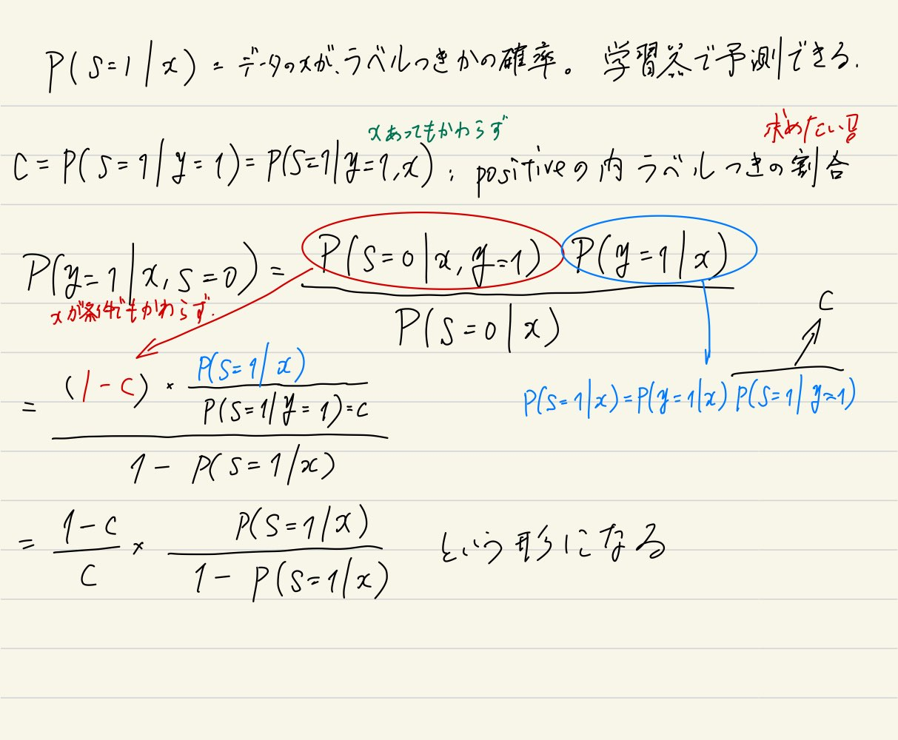

[元論文](https://cseweb.ucsd.edu/~elkan/posonly.pdf)

参考にしたサイトたち

https://mamo3gr.hatenablog.com/entry/2020/11/29/123147

https://speakerdeck.com/hellorusk/pu-positive-unlabeled-learning?slide=3

# 何なの？

ラベルはいっぱいあるけどつけるの間に合わん。普通はPositiveとNegativeにつけられたデータで行うが、PU Learningは**PositiveとUnknownで区分したデータで学習させる**。

生成モデルに基づく半教師付きの手法と違って、分布を仮定する必要はない。

# 手法

## 仮定、説明

サンプル$x \in \mathbb{R}$について、
- 正答$y \in 0, 1$があり、**1ならPositive、0ならNegative**である。
- ラベル$s \in 0, 1$があり、**1ならラベルあり、0ならラベルなし**

そして、未知だが$(x, y, s)$に**対する不変の分布がある**とする。

仮定として、Positiveなものしかラベル付けされてない、しかも一部。つまり**NegativeはUnknownである**。$p(s = 1| x, y = 0) = 0$

もう1つ仮定として、ラベル付けされるPositiveは、**Positiveの全体からランダムに選ばれると仮定する**。$p(s = 1 | x, y = 1) = p(s = 1 | y = 1) = 一定値c$。$x$に関係なく、取るという意味。

## 理論的なおはなし

条件付確率の分解をやる。「xであるときにy=1」$p(y = 1 | x)$と「xであって、y=1であるときにs=1」$p(s = | x, y = 1)$の積。依存関係はあるが関係はない。

$$
p(s = 1 | x) = p((y = 1 \And s = 1) | x) = p(y = 1 | x) p (s = 1 | x, y = 1) = p(y = 1 | x) \cdot c
$$

つまり、

$$
p(y = 1 | x) = \frac{p(s = 1 | x)}{c}
$$

つまり、データに対してPositiveである確率は、

1. $p(s = 1 | x)$　　データ$x$に対して、それがラベル付きかどうか。**これは通常の分類器で推定できるので問題なし**。
   1. 全部のデータと実際のラベル付きデータはあるんで、その分布を仮定する手法ならなんでも。深層学習でもいい。
2. $c = p(s = 1 | y = 1)$　　Positiveなラベルなら、印がつく確率。

がわかる or 推定できるなら、一番欲しい$p(y = 1 | x)$推定できる。

## 定数$c$の推定方法

というわけで、**$c = p(s = 1 | y = 1)$を推定することができれば、勝ちです**。

### 手法1

前述のとおり、$p(s = 1 | x)$「**データ$x$に対して、それがラベル付きかどうか**」。これは学習器で学習できる。その学習器に入れた時の結果を$g(x)$と置く。

$c = p(s = 1 | y = 1)$**Positiveなラベルなら、印がつく確率**。

ここで、訓練データと同じように抽出したテストデータ集合$V$を考える。**その中で、ラベルの付いてる集合**を$P$とする。

$$
c = \frac{1}{n} \sum \limits_{x \in P} g(x)
$$

つまり、$V$**のなかで実際にラベル付きのデータに対して、分類器でラベル付き=1か否か=0**を**、$|P|=n$**で割った平均**。$|V|$**ではない！**。これは**実際にラベル付きのデータに対してどれぐらい正確に予測できてるか**、ということを示す。

そして、分類器が正しく**訓練データについて**$p(s = 1 | x)$を学習できてるなら、これは**テストデータ(そしては訓練データ以外の全体のデータ)に対して、真のPositiveのデータのうち、ラベル付けされてるサンプルの割合**になる。

つまり、ちゃんと訓練データに対して学習をさせたから(もちろんその訓練データの中でまた訓練とテストに分けるけど)、同じ分布(未知だけど)に従ってPositiveのものにラベルがつくと仮定してる以上、**すでにラベルついてるデータに対して予測器でラベルつく割合を見つけられれば、それは全体のPositiveの者に対して、ラベル付きであるの割合だと**なる。

実際はだいたいそうならない。ちゃんと同じ分布に従うかな？でもこの手法はそれなりに正しいんですよこれ。

### 手法2

先ほどは、$p(y = 1 | x) = \frac{p(s = 1 | x)}{c}$で$p(y = 1 | x)$を求めた。

今度は、まず$p(s = 1 | x)$を学習してみる。次に

- **ラベル付きはそのまま**。
- **ラベルなしは、ラベルあり=重み**$w(x)$と**ラベルなし=重み**$1 - w(x)$**という2つの点に複製する。そして、もう一度、$p(s = 1 | x)$を重みつきで学習する。**

なお、重みは、$w(x) = p(y = 1 | x, s = 0)$とする。

こんな風に、**一度方法1から予測した**$c$から計算できる。

そして、これらの重みをそれぞれつけなおしたものから、もう一度$p(s = 1 | x)$を学習させるのだ。

### 実際の学習のフェーズ

実際、識別器はSVMのソフトマージンで実装される。だが、SVMのソフトマージンでの定式化での損失関数はヒンジ損失$z$を用いると、

$$
\frac{1}{2} || \mathbf{w} || + C_p \sum _{i \in P} z_i + C_U \sum _{j \in U} z_j
$$

この$C_P, C_U$は**経験則で決めるしかない**らしい。この手法をこの論文が**biased-SVM**と提案している。

- $C_U = 0.01, 0.03, 0.05, \cdots, 0.61$
- $\frac{C_P}{C_U} = 10, 20, \cdots, 200$
- **$C_P$に大きく重みを寄せる**。

### 評価

**手法2の方が実験的に精度が良い**。

どっちも、(論文は2だけ離散の分類器は無理らしいけど、全部離散は無理では？？？)分類器が離散だとNGらしい。

また、理論的に正しく境界を決めるには、誤差関数をnon-convex loss(SVMのhinge lossはNG)にしないとならないという難点がある。

