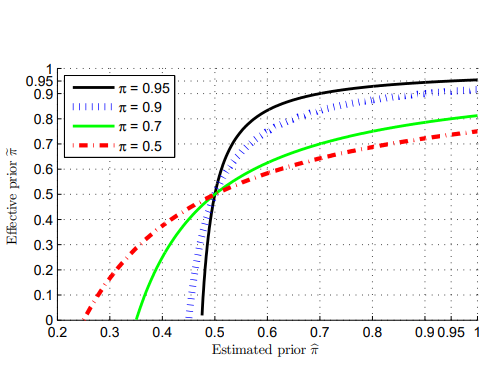

[元論文](https://proceedings.neurips.cc/paper_files/paper/2014/file/35051070e572e47d2c26c241ab88307f-Paper.pdf)

[参考したスライド](https://www.slideshare.net/Quasi_quant2010/quasi-quant2010-2)

[参考にした記事](https://nnkkmto.hatenablog.com/entry/2020/12/23/000000)

[**親戚論文の中国語解説　とっても良い**](https://blog.csdn.net/crazy_scott/article/details/88993441)

[SVMの総集編論文](https://www.csie.ntu.edu.tw/~cjlin/papers/libsvm.pdf)

---

PU Learningは結局、条件の下でのコスト最小化による最適化なので、SVMと同じようにやることができる。

この論文では以下の2点が判明した。

1. 凸関数(ヒンジ損失など)は、たとえ2つのクラスが完璧に分割できる場合でも、上手くいかないことがある。解決策は非凸の損失関数(ランプ損失など)を使うといい。
2. 事前分布$p(y = +1)$を推定するとき、分類誤差は真の$p(y = +1)$と推定クラス自演分布の両方に依存する有効クラス事前分布というものに依存する(これなに？)
3. 一般的な分類誤差の上界をMcDirmidの不等式で抑え、完全な教師ありと比べてもたかだか$2 \sqrt{2}$倍までしか悪くならないと示した。

## PU Learningはいかにして損失最小化となるのか。

[ここにある説明](../_index.md/#puの損失関数の定式化)を読むとわかりやすい。

## 非凸な損失関数がなぜ必要か

### 通常の分類で使われる損失関数

一番いいのは01損失だが、傾きは全くないので**代理損失関数**を使わないといけない。よく使われるのはランプ損失

$$
l _R (z) = \frac{1}{2} \max(0, \min(2, 1 - z))
$$

ランプ損失は非凸関数であるが、凸関数にしたかったらヒンジ損失

$$
l _H (z) = \frac{1}{2} \max(1 - z, 0)
$$

が候補となる。**完全に分類できる前提**では、非凸のramp損失によるリスク関数が0であるなら凸のhinge損失によるリスク関数も0になる。
そのうえで、凸性のあるhingeを使った方が勾配降下法による最適化にいいよね、というかたちなのでhinge損失が使われてきた。

### PU Learningにおける損失関数

PU Learningのリスク関数から損失関数の形を代入すると、以下のような形に。損失関数$l$は正の値を与えられると0だが、負になると大きくなるという性質を持つ。

ここで、リスク関数は最初から確率と定義されていることが重要である。**損失に01損失を使う限り、損失関数の期待値は確率(or条件付確率)と等しいからである**。このことから$1 - R _{fn}(g)$は、1から擬陰性の確率を引いたもので、**真にpositiveが分類器$g$で正しくpositiveに分類される確率**に該当する。
そして、$\mathbb{E} _{+1}[ l(-g(\mathbf{x})) ]$は、**正しく分類できたものが損失関数で正値を出しそれの期待値**に該当するので、**まさに$1 - R _{fn}(g)$に該当する**のである！

$$
R(g) = 2\pi R _{fn}(g) + R _{X}(g) - \pi \\\\ 
= 2 \pi \mathbb{E} _{+1} [ l(g(\mathbf{x})) ] + \pi (1 - \mathbb{E} _{+1} [ l(g(\mathbf{x})) ]) + (1 - \pi) \mathbb{E} _{-1}[ l(-g(\\mathbf{x})) ] - \pi \\\\
= 2 \pi \mathbb{E} _{+1} [ l(g(\mathbf{x})) ] + \pi \mathbb{E} _{+1} [ -l(g(\mathbf{x})) ] + (1 - \pi) \mathbb{E} _{-1}[ l(-g(\\mathbf{x})) ] - \pi \\\\ 
= \pi \mathbb{E} _{+1} [l(g(\mathbf{x}))] + (1 - \pi) \mathbb{E} _{-1}[ l(-g(\\mathbf{x})) ] - \pi + \pi \mathbb{E} _{+1}[ l(g(\mathbf{x})) + l(-g(\mathbf{x}))]
$$

ここで、最後の項の$l(g(\mathbf{x})) + l(-g(\mathbf{x}))$について、ramp損失とhinge損失それぞれの性質を考えてみる。
ここで、**うまいこと定数となった項は削除することができ、項の減少は最適化の局所最適解に陥る確率が同等かそれ以上に改善される**ことを意味している。

- ramp損失は$l(z) + l(-z) = 1$
- hinge損失は$l(z) + l(-z) = 1, z \in [-1, 1]$ それ以外は**定数ではない**！

このように、**PU Learningのリスク関数の定式化では、凸最適化がしやすいHinge損失では逆に項を削ることができずに、最適化が難しくなっていることを示唆している**。

なお、ランプ損失は、Convex-Concave Procedureという凸関数と凹関数によって構成される式の最適化を行う手法で無事に計算できる。

## 事前確率$\pi = p(y = +1)$の不正確な推定が及ぼす影響

cost-sensitiveでPU Learningを行うにあたり、$\pi = p(y = +1)$の正確な推定が必要。これが$\hat{\pi}$に推定された時どれほど誤差が起きうるのかを評価する。ラベルがすべて明確なPN Learningとみなしたとき、リスク関数は偽陰性$R _{fn}$と偽陽性$R _{fp}$を用いて、以下のように書けた。この時、モデル$\mathcal{G}$においてリスクを最小化する$g$がある。

$$
R(\pi, g) = \pi R _{fn}(g) + (1 - \pi) R _{fp}(g) \\\\ 
R ^ {*} (\pi) = \min _{g \in \mathcal{G}} R(\pi, g)
$$

これを経験的に予測して、ハットをつけると以下のようになる。

$$
\hat{R}(\hat{\pi}, g) = \pi R _{fn}(g) + (1 - \pi) R _{fp}(g) \\\\ 
R ^ {*} (\pi) = \min _{g \in \mathcal{G}} R(\pi, g)
$$

PU Learningでのリスク関数は以下のように評価できる。ここでは、推定した$\hat{\pi}$を導入する。

$$
R(g) = 2 \hat{\pi} R _{fn}(g) + R _X(g) - \hat{\pi}
$$

$R _X(g)$自体はこの論文で$R _{fn}, R _{pn}$で、$R _X(g) = \pi(1 - R _{fn}(g)) + (1 - \pi) R _{fp}(g)$と定義できるとわかっているので、代入すると以下のようになる。この定義の部分では、推定した$\hat{\pi}$を使う余地がない($R _X$は理想的な状況から計算する)。

$$
R (g) = 2 \hat{\pi} R _{fn}(g) L \pi(1 - R _{fn}(g)) L (1 - \pi) R _{fp}(g) - \hat{\pi} \\\\ 
= (2 \pi - \pi) R _1(g) + (1 - \pi) R _{fp} (g) + \pi - \hat{\pi}
$$

このことから、$\hat{\pi} \leq \frac{1}{2} \pi$の時は、$R _{fn}$(g)の係数が0以下になるので、**PU Learningができなくなる**とわかる。

また、上の誤差入り版の$R _{fn}, R _{pn}$の係数を同様に$\tilde{\pi}, 1 - \tilde{\pi}$の$R(g)$の形と見てみると、以下のようになる。この$\tilde{\pi}$は理想的には$\pi$に近づくことになる。

$$
\tilde{\pi} = \frac{2 \hat{\pi}}{2 \hat{\pi} - \pi + 1 - \pi} = \frac{2 \hat{\pi}}{2 \hat{\pi} - 2\pi + 1}
$$

グラフにすると以下のようになる。より$\pi$が大きいほど、$\hat{\pi}$の推定の範囲が広まっていてもだいたい平坦であるとわかる。

結論として、**$\pi$が大きいとき、$\hat{\pi}$の推定がガバガバでも大して問題は起きづらいが、$\pi$が小さいときはすぐ響いてくる**。

## PU Learningの誤差境界の理論的解析

