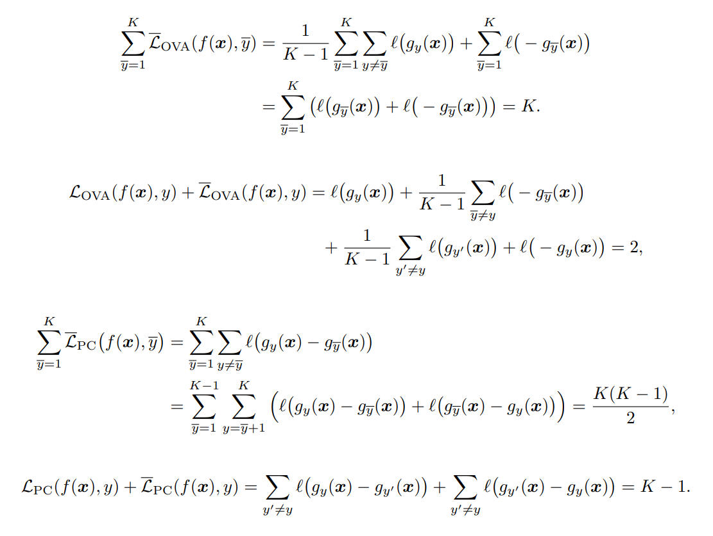

[元記事](../_index.md)

1つ目の式では、$y \neq \bar{y}$は$K - 1$回まわり、それを$\bar{y}$で$K$回イテレーションする。各要素単位では$K$回のイテレーションのうちに$\bar{y}$が一致する回だけ飛ばされるので、合計は$K - 1$となり、分母と打ち消して1となる。結果として、各$\bar{y}$ずつで$l(z) + l(-z) = 1$を使えば式変形ができる。

2つ目の式では、素直に代入すると、分母ある方ではシグマの中で$K - 1$回あるので打ち消し合い1になり、それ以外でも1となって合計2。

3つ目の式では、$\bar{y}, y$と$y, \bar{y}$のペアがどれほど作れるかを考える。対称性により、これらは1対1で対応され、$ _K C _2 = \frac{K (K - 1)}{2}$である。

4つ目の式では、代入すればちょうど相補的なので、$K - 1$となる。

