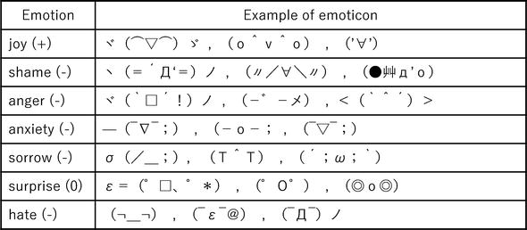
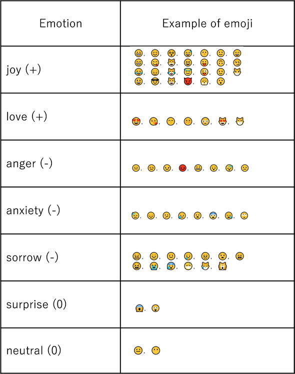
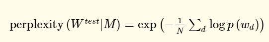

タイトル: Analysis of Information Spreading by Social Media Based on Emotion and Empathy
著者: Kazuyuki Matsumoto, Minoru Yoshida and Kenji Kita

# Introduction

バズや炎上ツイートについて、リプライを分析してみた。絵文字とかいろいろあるでしょ？

# 手法

感情表現、顔文字、意味ベクトル、Latent Dirichlet Allocation、情報エントロピー、性格分析の手法を使って、著名人のツイート、バズツイート、炎上ツイートの分析をしてみる。

## 日本語の感情表現

日本語はいろいろな感情表現がある。Japanese Appraisal Evaluation Expression Dictionaryを参考に、実装してみた。

例として、

- Positive: うっとり、浮かれる、楽しむ
- Negative: 憤る、うっぷん、悲しむ

## 顔文字

日本語特有の顔文字。顔文字について、アノテーションとして検出して意味を分析した。↓図のように。

## 絵文字

顔文字と同様に、感情としてアノテーションすべき。

## Semantic Vectors(Wiki2vec)

辞書で意味を理解するのは大事であるが、Twitterなどで固有名詞やスラングがあり、そのままでは向いてない。

この研究では、[2018年時点のWikipediaをもとに200次元のWordToVecを作った](http://www.cl.ecei.tohoku.ac.jp/~m-suzuki/jawiki_vector/)。

また、BERTも使っている。15%の言葉をMASKにして、BERTに予測させるらしい。BERTにfine-tuningを加えることで、特定タスクへの適用への応用ができる。

## トピック分析

LDAという手法を用いて、トピックを分析する。
Gensimでよくね？

## 情報理論

単語の出現率自体で、離散のエントロピーを求められる。

## 性格分析

性格診断をしたというTweetを投稿した人にまず絞る。

書いた投稿にたいしての他のユーザからの返信から性格を分析する。これは松本らが提案したニューラルネットワークがあるらしい。

# 分析結果

## 感情のポジネガによる分析

- 有名人ツイート　　ツイート者にたいして好意的な評価が多い。
- 炎上ツイート　　ネガティブな評価が多い。
- バズツイート　　**意外にも、炎上ツイートと同じ**だということ。

ただ、細かく見ると、炎上ツイートはバズツイートと比べて広がりに欠ける形か。多いのは`joy >> hate > love`の順番で変わらない。

## 顔文字の分析

バズるツイート、バズらないツイート、炎上するツイート、顔文字の出現頻度は違えども、使用する傾向は大体似てる。やっぱり、joyの時だけ顔文字使うね。遥か突き放されての次点が、anxiety, neutral。

あと、使和ない人はどんな場面でも使わないので、顔文字はやっぱり分析の特徴量になりえないかな。

## 絵文字の分析

どのタイプでも、`joy >> sorrow > love>` その他の形だった。

全体的に、Non Buzzのツイートで大量に使われたが、FlamingやBuzzではつかわれなかった。

To Sen: replaceで絵文字を付け加えるとflamingとか、Buzzを抑えられる説？

## 情報量の分析

バズらないツイートの平均エントロピーが低かったのは、長い返信がないから。これは分類のいい指標となる。

## 意味ベクトルの分析

返信について、BERT、Wiki2Vecの意味ベクトルをまずは取得し、別々、そしてつなげた768+100=868次元のベクトルにする。そして各ラベルについてk-meansを行って、t-distributed stochastic neighbor embeddingというもので高次元から二次元に落とし込んで、図にして分類してみた。

BERTでは、炎上、バズ、非バズに差はなかった。

wiki2vecと、868次元vectorでは、バズ、非バズは区別できないが、**明らかに炎上ツイートだけは区別できた**。BERTは汎用性の高い分散表現を識別するように訓練されてるので、**炎上ツイートへの返信はほとんど固有名詞が多い可能性がある**。

## トピックについて

今回は10と20で試した。前述のLDAを実施した。
perplexityという指標があり、低いほど、より正確な確率モデルである。

炎上とバズ、非バズのツイートについて、トピックでは大きな違いはない。

## 性格推定について

ニューラルネットワークを用いて返信のセットを推定すると、、5種類の自我状態の度合いを示すベクトルとして得られる。このベクトルを自我状態ベクトルと呼ぶことにする。自我状態ベクトルの形状に従って、性格パターンが29種類に分類される。

バズらないツイートでは性格にばらつきは大きく参考にならない。ただ、炎上とバズでは、あんまよい結果にならなかった？微妙。

# 討論

顔文字や絵文字だけで意見はやはりわからにあので、言語情報と非言語情報の両方を分析するべきだな。

ただ、問題として返信数について捉えてるが、バズらない、炎上しないと返信が増えない。逆に増えてしまった場合すべてをカバーできない。**フォロー、フォロワー関連と返信文の内容との相関を見るべきだな**。

# 結論

返信によって、バズ、非バズ、炎上を分類できるという可能性を見た。

炎上とバズは、情報の拡散では似ているが、お互い区別せねばならない。ツイートの種類ごとに特定の条件を考慮し、両社の違いを分析するのがfuture workだね。