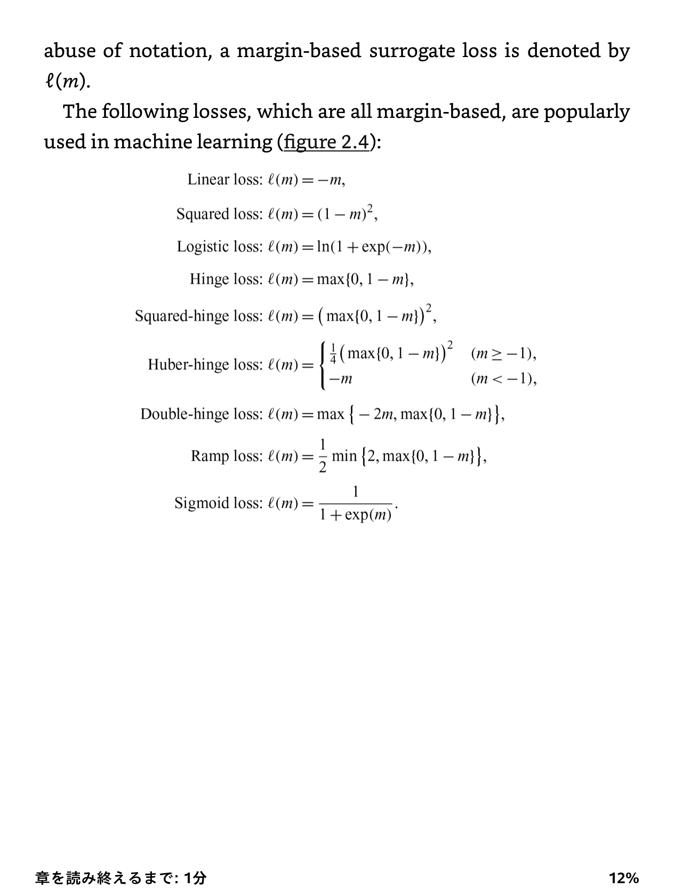

第1章　問題の定式化

# 二値分類

二値分類において、データ$\mathbf{x}$について、ラベル$y = -1, +1$の二種類のみが存在する。
そして、分類器$g : \mathbb{R} ^ d \to -1, +1$と定義できる。

究極的には、以下の**損失**を最小化することを学習では目指す。

$$
l(g) = \mathbb{E} _{p(\mathbf{x}, y)} [ l _{01} (g(\mathbf{x}), y) ]
$$

ここで、$l _{01}$は**01損失**と呼ばれる損失として定義される。

> 予測結果$g(\mathbf{x})$と真のラベル$y$が一致すれば0、一致しなければ1という

## 学習器のモデル

section 1でも行ったように学習器の概形はmodelという。

### 線形モデル

つまりSVM。係数ベクトル$\mathbf{a}$の訓練をするかたち。

$$
g(\mathbf{x}) = \mathbf{a} ^ T \mathbf{x}
$$

しかし、これは線形分類可能な例でのみ有効であり、このままでは表現力にすぐれない。

### 基底変換付き線形モデル

係数ベクトル$\boldsymbol{\Phi}(\mathbf{x}) = (\phi _1(\mathbf{x}), \cdots, \phi _{d ^ {\prime}} (\mathbf{x})) ^ T$とする。各基底がそれぞれ$\mathbf{x}$から変換を施した($d = d ^ {\prime}$である必要もない)のちに、線形モデルと同様に係数ベクトル$\mathbf{a}$を学習するかたち。

$$
g(\mathbf{x}) = \mathbf{a} ^ T \boldsymbol{\Phi}(\mathbf{x})
$$

基底変換によって表現力は確かに上がったが、本質的にはまだ線形の表現力である。また$d$が増えるにつれて、表現力を落とさないために$d ^ \prime$も結局は増やさないといけなくなる。

### カーネル法

[カーネル法について勉強したい人へ](https://www.amazon.co.jp/%E3%82%AB%E3%83%BC%E3%83%8D%E3%83%AB%E6%B3%95%E5%85%A5%E9%96%80%E2%80%95%E6%AD%A3%E5%AE%9A%E5%80%A4%E3%82%AB%E3%83%BC%E3%83%8D%E3%83%AB%E3%81%AB%E3%82%88%E3%82%8B%E3%83%87%E3%83%BC%E3%82%BF%E8%A7%A3%E6%9E%90-%E3%82%B7%E3%83%AA%E3%83%BC%E3%82%BA-%E5%A4%9A%E5%A4%89%E9%87%8F%E3%83%87%E3%83%BC%E3%82%BF%E3%81%AE%E7%B5%B1%E8%A8%88%E7%A7%91%E5%AD%A6-%E7%A6%8F%E6%B0%B4-%E5%81%A5%E6%AC%A1/dp/4254128088/ref=pd_ybh_a_9?_encoding=UTF8&psc=1&refRID=998753GME9XAEJK7HK32)　オーバーキル気味だけど。

カーネル関数$K(\cdot, \cdot)$を用いて、$a _1, \cdots, a _N$のパラメタと、$\mathbf{x} _1, \cdots, \mathbf{x} _N$のベクトルのパラメタを使い、識別器を次のように定義できる。

$$
g(\mathbf{x}) = \sum _{i = 1} ^ N a _i K(\mathbf{x}, \mathbf{x} _i)
$$

カーネル関数を用いることで、例え$d$が増加しても、ガウシアンカーネルなどは無限次元の表現力を持っているので(実際に特徴を所定の次元でうまく抽出ができるかはアンカー$\mathbf{x} _i$の選び方次第になるが)、$N$はそこまで増加しなくても問題なかったりする。

一般的には、$\mathbf{x} _i$たるアンカーは、データ点のうちから何点かを選んで、というのがよくある。

また、式の形からこれは$\mathbf{a}$との線形結合でもあるので、最適化も容易ではある。カーネル法は**ノンパラメトリックのモデル**である。理由としては、**次元数の増加によって$N$は大して増やさなくてもいいが、データ数の増加に大しては$N$はある程度増やす必要があるから**。

よく使われるカーネル関数として、ガウシアンカーネルがある。

$$
K(\mathbf{x}, \mathbf{x} ^ {\prime}) = \exp(- \frac{|| \mathbf{x} - \mathbf{x} ^ {\prime} || ^ 2}{2 \sigma ^ 2})
$$

このアンカー$\mathbf{x} ^ \prime$はgaussian centerともいい、$\sigma$はGaussian bandwidthという。

**カーネル法は総じて、データは大して多くはないかもしれないが低次元の多様体(manifold)↑に分布していて(これなに？)、特徴量次元がとにかく大きい場合に有効**。

### Neural Network

NNの専門書ではないのであまりに詳細な記述は省く。NNは非線形モデルであり、層を深くすることで表現力を上げることができるが、訓練データの多さに結局表現力は依存する。つまりちゃんと大量のデータを集めるしかない。

## 代理誤差関数(Surrogate Loss)

01損失で定義された$l(g) = \mathbb{E} _{p(\mathbf{x}, y)} [ l _{01} (g(\mathbf{x}), y) ]$は、傾きがないので勾配降下法ベースの最適化手法を行うことができない！実際、01損失を含む式の最適化をするのはNP-Hardであることが知られている。悲しいね。

となると、01損失の代わりとして使われる、**$g(\mathbf{x})$が小さいと、$l(\mathbf{x}, y)$は大きくなる性質を持つ代理損失関数**を考えなければならない。ここで代理損失関数を使う以上、本来の損失関数の和たるLossを最小化したらマイナスになった、最適解を求めても実際はうまく行かない、などということが起きてしまう。それをできるだけ防ぎたいですね。

ここで、$y = +1, -1$のみを取り得るので、$y g(\mathbf{x})$という値自体を代理誤差関数に代入するという考えも考えられる(負なら予測が間違うことになる)。**$y$と$g(\mathbf{x})$のそれぞれ別々に代理誤差関数が依存するのが、$y g(\mathbf{x})$という1つにまとめた量に依存する時、margin-based surrogate function**という。(なお、01損失も$yg(\mathbf{x})$を引数として受け取り、0未満=不正解なら1、0以上=正解なら0と考えられる)

主な損失関数例。これらはすべてmargin-basedである。
これらの関数の全ては下限を持ち、sigmoid, ramp損失はそれぞれ上限を持つ。
また、sigmoid, ramp以外の損失は凸関数の形をしており、最適化を行う際にやりやすい。

## 訓練データ

代理損失関数を用いたとしても、このままでは$p(\mathbf{x}, y)$の真の分布がわからないから訓練を行うことはできない。まず以下の三種類の訓練データを分類できる。

- positiveの訓練データ　$[\mathbf{x} _i ^ P] _{i = 1} ^ {N _P} \overset{i.i.d}{\sim} p _P(\mathbf{x}) = p(\mathbf{x} | y = +1)$
- negativeの訓練データ　$[\mathbf{x} _i ^ N] _{i = 1} ^ {N _N} \overset{i.i.d}{\sim} p _N(\mathbf{x}) = p(\mathbf{x} | y = -1)$
- unlabeledの訓練データ　$[\mathbf{x} _i ^ U] _{i = 1} ^ {N _U} \overset{i.i.d}{\sim} p _U(\mathbf{x}) = p(y = +1) p(\mathbf{x} | y = +1) + p(y = -1) p(\mathbf{x} | y = -1)$
  - 中身が不明なので、事前分布の$p(y = +1)$などを使い、positiveとnegativeの従う分布から混合するかたちで合成する。
  - $y$を消した周辺分布ともいえる。

この分布らを元にした期待値を使うことで、**リスク=所定のクラスの誤差関数の期待値**を定義できる。

$$
\mathbb{E} _{P} [ \cdot ] = \int \cdot p _P(\mathbf{x}) d\mathbf{x}
$$

positiveのデータのリスク$R _P (g)$、negativeのデータのリスク$R _N (g)$は以下のように期待値で定義できる。

$$
R _P (g) = \mathbb{E} _{P} [ l(g(\mathbf{x}), +1) ] \\\\ 
R _N (g) = \mathbb{E} _{N} [ l(g(\mathbf{x}), -1) ]
$$

同様に、$R _U (g)$を考えることもできる。$\mathbb{E} _U [ \cdot ] = \int \cdot p _U (\mathbf{x}) d \mathbf{x}$である。
unlabeledのデータのpositiveであるリスク、negativeであるリスクはそれぞれ$R _{U, P}, R _{U, N}$とすると、

$$
R _{U, P} (g) = \mathbb{E} _{U} [ l(g(\mathbf{x}), +1) ] \\\\ 
R _{U, N} (g) = \mathbb{E} _{U} [ l(g(\mathbf{x}), -1) ]
$$

ここは本に書いてないが、$R _{U}(g)$はpositiveとnegativeの両方のリスクを、$p(y = +1)$などの割合で重みを付けた和ではないのか？下式のように

$$
R _{U}(g) = p(y = +1) R _{U, P}(g) + p(y = -1) R _{U, N}(g)
$$

なお実際に期待値は厳密には得られないので、下式のように不偏推定量で代用する。

$$
R _P (g) = \mathbb{E} _{P} [ l(g(\mathbf{x}), +1) ] \\\\ 
\hat{R _P} (g) = \frac{1}{N _P} \sum _{i = 1} ^ {N _P} l(g(\mathbf{x} _i), +1)  
$$

## 正則化項

過学習を防ぐために、係数ベクトルのノルムが過大にならないように正則化項が付け加えられる。つまり、定数$\lambda$と正則化関数$\Omega(\mathbf{a})$は、以下のように項として付け加える。

$$
\cdot + \lambda \Omega(\mathbf{a})
$$

$\Omega(\mathbf{a})$としてよく使われるのは、2乗ノルムだが、以下のような候補がある。

謎コメント: リッジ正則化はaの要素をゼロに向かって縮める（つまり、ゼロに近い値をとるようにする）のに対し、ラッソー正則化はaの要素をスパース化する（つまり、正確にゼロをとるようにする）。　これはなに？

