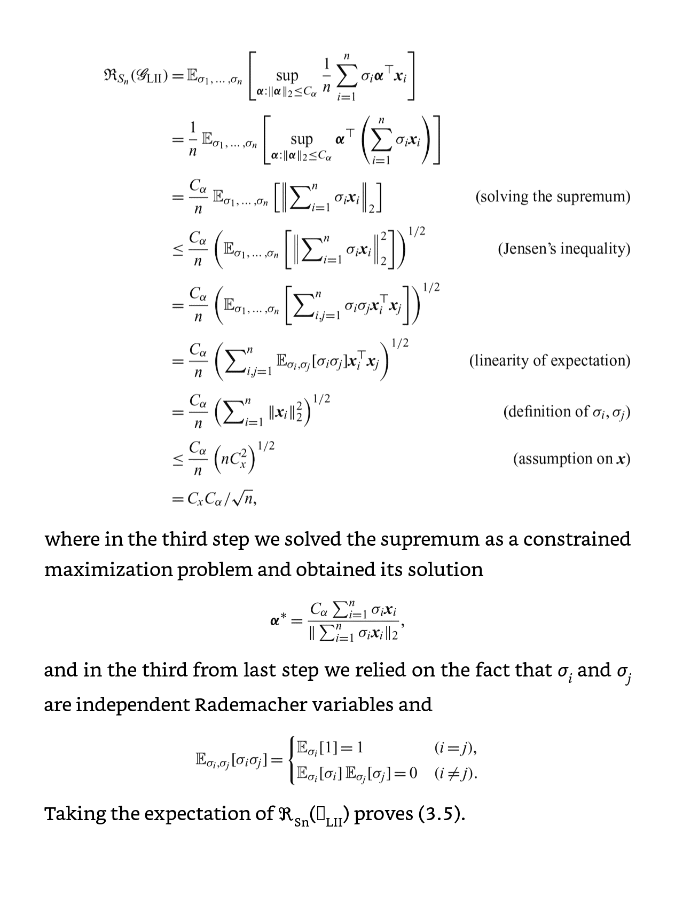

第3章　PN Learning

# 二値分類でのPN Learning

## 定式化

PとNの訓練データが同時に取得したか、別々に取得したかで定式化が異なる。

### 同時に取得

$$
[ (\mathbf{x} _i, y _i) ] _{i = 1} ^ N \overset{i.i.d}{\sim} p(\mathbf{x}, y)
$$

このように同時に取得されたものは、分類が容易である。以下の損失関数を最小化すればよい。正則化項を加えるのを忘れずに。

$$
R(g) = \mathbb{E} _{p(\mathbf{x}, y)} [ l(g(\mathbf{x}), y) ] \\\\ 
\hat{g} = \argmin _{g} \hat{R} (g) + \lambda \Omega(g)
$$

どう見てもこれソフトマージンのSVMとほぼ同じじゃないですか。ただ訓練データのpositive vs negativeが1:1に限らないが。

### 別々に取得

$$
[ \mathbf{x} _{P, i} ] _{i = 1} ^ {N _P} \overset{i.i.d}{\sim} p(\mathbf{x} | y = +1) \\\\ 
[ \mathbf{x} _{N, i} ] _{i = 1} ^ {N _N} \overset{i.i.d}{\sim} p(\mathbf{x} | y = -1)
$$

このように別々に、前提条件が異なる分布から取得する。この場合、より柔軟に強力な分類アルゴリズムを開発できる(らしい)

$N _P \neq N _N$もあり得るので、サンプル数が不均等であることもあり得る。損失関数を以下のように定義する。これに正則化項を加えた

$$
R _P(g) = \mathbb{E} _{p(\mathbf{x}, y = +1)} [ l(g(\mathbf{x}), +1) ] \\\\ 
R _N(g) = \mathbb{E} _{p(\mathbf{x}, y = -1)} [ l(g(\mathbf{x}), -1) ] \\\\ 
R(g) = p(y = +1) R _P(g) + p(y = -1) R _N (g)
$$

実を言うと別々に取得の式は同時取得を包含している形ともいえる。

## 理論的解析

分類器$\hat{g}$の訓練がちゃんと最適な解へ収束すれば、理論的にはこの方法はうまく行く。収束先として3つの分類器を考える(当然この3つの理想的な分類器はいずれも最適である)。

1. 真の代理損失関数を使ったリスク関数(不偏推定量でつくるものではなく)を最小化したものを収束目標とする。ただし、$g$は所定のモデル$\mathcal{G}$に所属している前提で。
   1. $g ^ {*} = \argmin _{g \in \mathcal{G}} R(g)$
2. 真の代理損失関数を使ったリスク関数を最小化する。$g$は任意の可測関数。
   1. $g  _R ^ {\star} = \argmin _{g} R(g)$
   2. これはベイズ最適化分類器(optimal classifier)の最小化とも呼ばれているらしい。
      1. ベイズ最適化分類器とは、
   3. $R ^ * = \inf _{g} R(g) = R(g _R ^ \star)$。真のリスク関数に対しての最小化を行った関数。
      1. これは$R(g)$に対して完全に一致する。
3. もっと割り切るなら、代理損失関数を使わない0-1損失関数自体で定義すればいい。
   1. $g _I ^ {\star} = \argmin _{g} \mathbb{E} _{p(\mathbf{x}, y)} [ l _{01} (g(\mathbf{x}, y)) ]$
   2. $I ^ {\star} = \inf _{g} I(g) = g _{I} ^ \star$
      1. gradientがない最適関数になる。
      2. これも$I(g)$に対して完全に一致する。

正確な厳密さは3 > 2 > 1となる。

理論的には、代理損失関数$l$は$l _{01}$の代替をするにあたって、以下の要件を満たす必要がある。

ある写像$\alpha$を考える。
1. $\alpha : [0, 1] \to [0, +\infty)$
2. $\alpha$は凸の写像で、広義単調増加。
3. $\alpha$は逆写像を持つ。
4. $\alpha(0) = 0$

以上の要件を満たす$\alpha(x)$の例としては、$\tan(\frac{2x}{\pi})$がある。

そして、そのような$\alpha$に対して、以下の条件をみたさなければならない。

$\alpha(I(g) - I ^ {\star}) \leq R(g) - R ^ \star$

上式の条件を使うと以下のように落ち着く。

$$
0 \leq I(g) - I ^ \star\leq \alpha ^ {-1} (R(g) - R ^ \star) = \alpha ^ {-1} (0) = 0
$$

両側0で挟めるので、やはり$I ^ *, R ^ *$もそれぞれ$I(g), R(g)$の最小値となる。つまり、理論上の01損失、代理損失関数(ただしαのような都合の良い写像がある場合)のどちらに収束する、としても問題はない。

### 収束対象は何が妥当か

2関数の距離は以下のように定義できる。これは無限次元ノルムである。

$$
d _{\infty} (a, b) = \sup _{x \in \mathcal{X}} |a(\mathbf{x}) - b(\mathbf{x})|
$$

こういうのを使って、$d _{\infty} (\hat{g}　_{ML}, g ~ *)$を最小化したいところだが、一般的には$\hat{R(g _{ML})} - R(g ^ *)$を最小化させる。3つの理由がある。(大原則として、学習基準や損失関数はconvexの方が最適化を行う際に局所最適解にならないので望ましい)

1. 損失関数がconvexじゃないとき、それを使い作られた(最小化された)識別器もconvexではないようなものは1つは存在するから。
   1. convexじゃない関数同士で上式の無限次元ノルムの定義通りの計算って難しいから妥協して$\hat{R(g _{ML})} - R(g ^ *)$となる。
   2. ランプ損失、シグモイド損失がいい例。
   3. 例え損失関数がconvexであっても、学習基準がconvexじゃない可能性がある。(構造は「**損失関数を含む式が学習基準で、学習基準を最小化する関数が識別器**」)
2. 識別器でconvexであっても、その識別器のパラメタ$\mathbf{a}$でconvexではなくなる可能性がある。
   1. $\mathbf{a}$に対して、$g$が非線形ならばconvex性は担保されない。
      1. 最たる例はニューラルネットワークを$g$として使うとき。
3. $g ^ *$(あるモデル下での最適な分類器)や$g _R ^ *$(あるモデル)は真の確率分布から得られたものと違う分布である可能性がある。なんかあったが**理解できなかった**！

そして、理論的解析には以下の4要素が重要である。

- estimation error 定義は$R(\hat{g} _{ML}) - R(g ^ *)$
  - 訓練データの数量と、$g$の所属するモデルの複雑さに依存する。
    - 訓練データが多いほど、小さくなる。無限のデータで訓練はできないので、常に存在してしまう。
    - モデルの複雑さが小さい(動かせるパラメタの自由度が低い)場合、小さくなる。(なぜならば動かせるパラメタ自体少ないので、まずい局所最適解に陥る可能性が低い)
  - なお、これ自体は不偏推定量ではある。
- approximation error 定義は$R(g ^ *) - R(g _R ^ {\star})$
  - ベイズ最適化分類器はベイズ統計の知識を使って、一番誤分類率が低い分類器。
  - だが、理想のベイズ最適化分類器が所属するモデルが$\mathcal{G}$に属しない可能性がある。そうなると、$R(g ^ *)$の方が大きくなってしまう。 
    - つまり、分類器$p(y | \mathbf{x})$の所属するモデルがわかっていれば、このerrorはゼロにできる。
  - $\mathcal{G}$が大きいほど、このerrorは小さくなる傾向がある。
- excess risk
  - estimation error + approximation errorである。$R(\hat{g} _{ML}) - R(g _R ^ \star)$
  - **これが0へと収束することを示せればいい！**
  - この量は上の2つの和なので、$\mathcal{G}$としては、以下のトレードオフの状態を産んでしまう。
    - $\mathcal{G}$があまりに小さければ、estimation errorは自由度が低いので小さくなる。一方で、approximation errorは大きくなる。結果、学習不足でexcess riskが大きくなる。
    - 逆にあまりに大きければ、estimation errorは自由度が高いので大きいが、approximation errorは小さくなる。結果、過学習でexcess riskが大きいまま。
  - つまり、大きすぎず、小さすぎない$\mathcal{G}$を選ぶことが重要である。
- uniform deviation $\sup _{g \in \mathcal{G}} | \hat{R} _{ML} (g) - R(g)|$ 
  - 実際に真の$R(g)$はわからないから、不偏推定量で$\hat{R} (g)$を推定するしかない。この推定の際に、真の$R$と推定した$\hat{R}$の間に産まれるerror。(最悪な場合の$g$ではどうなるか、で評価)
  - 1つの識別器に対しての、異なる学習基準があるがために起因しているといえる。
  - 指定の$g$に対しては、大数の法則で$\hat{R}$は真のリスク関数$R$へ収束するとわかっている。
  - $\mathcal{G}$の場合、上記の最悪ケースの$g$を使った評価でも、ちゃんと真のリスク関数$R$へと収束する。
  - このdeviationはデータの多さ、モデルの複雑さに依存する。

**estimation errorとuniform deviationの上限は、高い確率で成立すればOKという証明方法で行く**。データ量を増やすにつれて、estimation errorが高い確率で0へ近づくのならば、学習は弱い意味で一貫性を持つと言える。つまり下式。

$$
\lim _{n _P, n _N \to \infty} R(\hat{g} _{ML}) - R(g ^ *) = 0
$$

なお、強い一貫性を持つというのは、$n _P, n _N$が増えるにつれてモデルの複雑度も上がるような(ノンパラメトリック系？)モデル$\mathcal{G}$においても、($R$ではなく、$I$という01損失でやる)下式が成り立つということ。

$$
\lim _{n _P, n _N \to \infty} I(\hat{g} _{ML}) - I(g ^ *) = 0
$$

だが、上の強い一貫性では、上手いことこれを満たすクラスを見つけることは難しい。なので、**弱い一貫性を証明で使うのが基本らしい**。

generalization errorは分類の時のエラー$\hat{R}(g _{ML}) - I(g)$であるが、この議論では考えない方が良い。あまりに多くのことに関連しているので話すときにこれを持ち出すと面倒。

### Rademacher Complexity(ラデマッハ複雑度)

[補助のおよみものブログ](https://dw-dw-dt.hatenablog.com/entry/2022/05/25/031243)

$\mathcal{G}$の複雑度を測るのに、ラデマッハ複雑度がおすすめである。
リスクを推定し、その推定した経験的リスク関数を最小化するが、

まず、ラデマッハ分布(下式)に従うラデマッハ変数$\sigma$があるとする。ベルヌーイ分布の0を-1にしたともいえる。

$$
p(\sigma = +1) = p(\sigma = -1) = \frac{1}{2}
$$

ラデマッハ変数は、モデルの複雑度を決定するうえで完全なランダムノイズであり、下式では互いに独立したラデマッハ変数$\sigma _1, \cdots, \sigma _n$が存在する。以下のラデマッハ複雑度の定義式を見るとわかるように、ランダムに正か負かに割り振っている。$\mathbf{s} \in S$だとする。対象の全てのベクトル$\mathbf{s}$に対して、**ラデマッハ変数をその成分に乗じたものの和の期待値である**。

$$
\mathcal{R}(S) = \mathbb{E} _{\sigma _1, \cdots, \sigma _n} [ \sup _{(s _1, \cdots, s _n)} \frac{1}{n} \sum _{i = 1} ^ n \sigma _i s _i]
= \mathbb{E} _{\boldsymbol{\sigma}} [ \sup _{\boldsymbol{s}} \frac{1}{n} \boldsymbol{\sigma} ^ T \mathbf{s}] 
$$

ここで、内積$\boldsymbol{\sigma} ^ T \mathbf{s}$は2つのベクトルの向いてる方向の近似度の指標にもなるので、**ラデマッハ複雑度はランダムに生成されたノイズと実際に学習した結果の一致度の期待値と言える**。これが高ければ、**どんなランダムなノイズに対してもfitするようなモデルであることを示しており、複雑度が高いということ**。

ラデマッハ複雑度は実際のところ、分類器を代入して、経験的に不偏推定量で求める。下式のように、$\mathbf{s}$には具体的に$g(\mathbf{x})$を当てはめることで、モデル$\mathcal{G}$に含まれる学習器$g$を考える。

$$
\mathcal{R} _S (\mathcal{G}) = \mathbb{E} _{\boldsymbol{\sigma}} [ \sup _{g \in \mathcal{G}} \frac{1}{N} \sum _{i = 1} ^ N \sigma _i g(\mathbf{x} _i) ]
$$

なお、任意の分布$q(\mathbf{x})$から訓練データ$\mathbf{x} _1, \cdots, \mathbf{x} _N$が得られたとする(この分布を$p _N, p _P$にすればPN Learningそのものになる)。こう考えると、**前述のランダムなノイズに対してのfitと同様に、どんなランダムなノイズに対しても、モデルに属する識別器のfitする度を、全ての訓練データ$\mathbf{x} _i$で期待値を取っている**ともいえる。

ラデマッハ複雑度は複数の定義がある。以下に書いておく。全部絶対値でくくっていいので、その場合は$\mathcal{R}(S) \leq \mathcal{R} ^ \prime (S)$が当然成り立つ。
その上、$\mathbf{s} , -\mathbf{s} \in S$か$g, -g \in \mathcal{G}$が成り立つのであれば、当然$\mathcal{R}(S) = \mathcal{R} ^ \prime (S)$となる。

このことから、損失関数が非負ならば$g, -g \in \mathcal{G}$に入ることはない(あってる？？？)

$$
\mathcal{R} ^ \prime (S) = \mathbb{E} _{(\boldsymbol{\sigma})} [ \sup _{\mathbf{s} \in S} |\frac{1}{n} \boldsymbol{\sigma} ^ T \mathbf{s}| ] \\\\ 
\mathcal{R} _S ^ \prime (\mathcal{G}) = \mathbb{E} _{\boldsymbol{\sigma}} [ \sup _{g \in \mathcal{G}} |\frac{1}{N} \sum _{i = 1} ^ N \sigma _i g(\mathbf{x} _i)| ] \\\\ 
\mathcal{R} _S ^ {\prime} (\mathcal{G}) = \mathbb{E} _{\mathbf{x}_1, \cdots, \mathbf{x} _n} \mathbb{E} _{\boldsymbol{\sigma}} [ \sup _{g \in \mathcal{G}} |\frac{1}{n} \sum _{i = 1} ^ N \sigma _i g(\mathbf{x} _i)| ]
$$

**ある程度重要な上限の抑え方として、リプシッツ収束関係のものがある**。

Talagrand Contraction Lemmaによると、[リプシッツ連続](https://mathlandscape.com/lipschitz/)(変化率に定数の上限がある場合)の関数$f$について、$f(0) = 0$、変化率の上限に当たる定数=リプシッツ定数$L _f$ならば、$lを代入したもの \leq \mathcal{R} _S ^ \prime (\mathcal{G})$が成り立つ。

### ラデマッハ複雑度での上界

#### 線形モデル$\mathbf{a} ^ T \mathbf{x}$の場合
\
訓練データに関しては、正規化をすることにより$\mathbf{x}$は有界である。係数ベクトル$\mathbf{a}$も、正規化項を付けているので有界である。いずれも有界ということは、**$|| \mathbf{x} || _2 \leq C _x$だとすれば、$|| \mathbf{a} || _2 \leq C _a$で抑えられる**ということだ。具体的な式変形によって以下のように評価できる。

$\mathbf{a} ^ *$は、$\sigma _i$が各々で動く中で、$\sigma _i$も使って$\mathbf{a} ^ *$を構成するという条件下では、上記のものが最適である。これの2乗ノルムでは、分子の内積を分母で打ち消しているので確かに$C _a$に収まる。

また、イェンセンの不等式$\mathbb{E} [ f(x) ] \leq f(\mathbb{E} [ x ])$を用いて、$f(x)$を$x ^ 2$としたうえで、全体に$1/2$乗がかかっている状態でイェンセンの不等式が成り立つ(上の式はf(x)と1/2乗で打ち消し合って何もないように見える)。注: [イェンセンの不等式のおすすめの使い方](https://qiita.com/kenmatsu4/items/26d098a4048f84bf85fb)とかはここを参照。

**期待値の展開部分では、$i = j$は同じ変数の2乗なので必ず1となる。$i \neq j$の場合、$\sigma _i, \sigma _j$の全パターンを考えると、ちょうど打ち消し合うので0となる**。この性質はかなりラデマッハ複雑度を評価するうえで重要。

結果として、$\frac{C _a C _x}{\sqrt{n}}$が取り得る上界だと評価でき、これがラデマッハ複雑度となる。式から、訓練データの数$n$が増加するにつれて、$\sqrt{n}$に反比例するかたちで複雑度が低下することがわかる。

#### 線形パラメタモデル$g(\mathbf{x}) = \mathbf{a} ^ T \boldsymbol{\phi}(\mathbf{x})$

$$
g(\mathbf{x}) = \mathbf{a} ^ T \boldsymbol{\phi}(\mathbf{x}) = a _1 \phi _1 (\mathbf{x}) + \cdots
= a _1 K(\mathbf{x}, \mathbf{b} _1) + \cdots = a _1 K(\mathbf{b} _1, \mathbf{x}) + \cdots
$$

線形パラメタと書いたがもちろんカーネル法も含む。$\phi(\mathbf{x})$はデータを別の空間へ移す写像で、この上で線形分類を行う。
実際はカーネル関数$K(\mathbf{a}, \mathbf{b})$のようにデータをそのまま代入するが、

カーネルのアンカー$\mathbf{b} _j$(計$m$個)を使い、$\phi _j(\mathbf{x}) = K(\mathbf{x}, \mathbf{b} _j)$となる。この時、以下の式のように。同様に再生核ヒルベルト空間の内積のかたちに書き直せる。

$$
<\mathbf{a}, \mathbf{b}> _{\mathcal{K}} = K(\mathbf{a}, \mathbf{b}) \\\\ 
\mathbf{w} = (a _1 \mathbf{b} _1, \cdots, a _m \mathbf{b} _m) ^ T \\\\ 
g(\mathbf{x}) = <\mathbf{w}, \mathbf{x}> _{\mathcal{K}}
$$

線形モデルと同様にラデマッハ複雑度を考える。$\mathbf{x}$が与えられたとき、$|| \mathbf{w} || _\mathcal{K} ^ 2$が収束するとまず示す。

$$
|| \mathbf{w} || _\mathcal{K} ^ 2 = || \sum _{i = 1} ^ m a _i \mathbf{b} _i || _{\mathcal{K}} ^ 2
= <\sum _{i = 1} ^ m a _i \mathbf{b} _i, \sum _{i = 1} ^ m a _i \mathbf{b} _i> \\\\ 
= \sum _{i = 1, j = 1} ^ m a _i a _j <\mathbf{b} _i, \mathbf{b} _j> _{\mathcal{K}} = \sum _{i = 1, j = 1} ^ m a _i b _j K(\mathbf{b} _i, \mathbf{b} _j)
$$

### 誤差の評価

