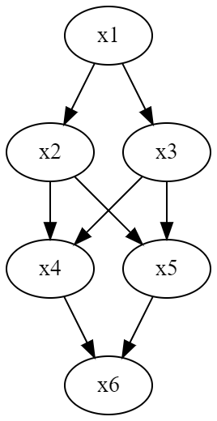
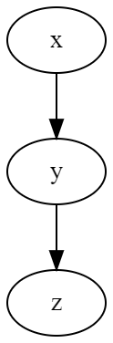
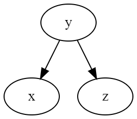
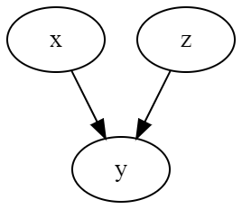
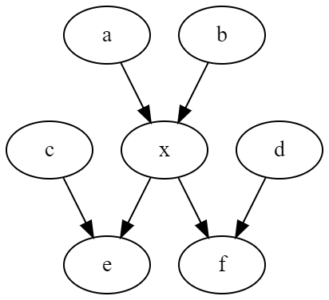

# 機械学習とは

機械学習とは、**いい感じに予測する学習器を作る**こと。代表的なタスクは以下の通り。

## 回帰

いい感じのデータ点を当てはめる式を作る。線形回帰ならば$y_n = \mathbf{w} ^ \mathbf{x}_n + \epsilon_n$ (1.1)。$\epsilon_n$はノイズで、ある分布に従う。

線形回帰のうち、$\mathbf{x}_n = (1, x_n, x_n^2, \cdots ) ^ T $のものを**多項式回帰**という。

## 分類

二値分類など。連続値から離散値にする。よく使われるのは、

$$
\mathrm{Sig}(x) = \frac{1}{1 + e^{-x}}
$$

これを使うことで、$(-\inf, +\inf)$を$(0, 1)$に変換できる。これが確率らしきものなので、確率と考えてもいい。

これを**多クラス分類に拡張**すると、**ソフトマックス関数を使えばいい**。
入力は$\mathbf{a} = (a_1, a_2, \cdots, a_K) ^ T$という$K$次元のベクトルで、それぞれが**各クラスを代表する値**。クラス$k$である確率は

$$
\mathrm{SM}_k(\mathbf{a}) = \frac{e^{- a_k}}{\sum _{i = 1}^{K} e^ {- a_i}}
$$

こうすることで、$\sum _{i = 1} ^ K \mathrm{SM}_i (\mathbf{a}) = 1$を満たす確率らしきものに変換できる。

## クラスタリング

与えられたデータの近くのグループをまとめる感じ、

## 次元削減

$D \times N$の行列$\mathbf{Y}$を、$M \times D$の行列$\mathbf{W}$と$M \times N$の行列$\mathbf{X}$で近似する分解手法。

$$
\mathbf{Y} \approx \mathbf{W} ^ T \mathbf{X}
$$

ここで、$D, N >> M$となると、本来$O(DN)$必要なメモリが$O(M(D + N))$に圧縮できる。**完全な復元は無理であるが、近似できればいいと考えれば有効な削減方法**。

# 機械学習のアプローチ

## ツールボックス

既知の機械学習の手法について、何かしらの基準に従って性能が良い手法を選んで識別器を作るという考え。教師データでラベル付きのものを使うので、教師アリ学習となる。

複雑な数学の知識無くても使えるが、本当に上手くfitする手法があるとは限らない。

## モデリング

**データに関するモデルがあると仮定して、事前にそれを構築する**。そのパラメタを学習データから訓練する。数学バリバリ使う。

柔軟性は高いが訓練は大変で数学も大変。

# 独立と条件付確率

$y_1, y_2$が独立なら、同じ前提条件の下(条件なしでも、条件が何でも)、必ずこれが成り立つ。

$$
p(y_1 | x) p(y_2 | x) = p(y_1, y_2 | x)
$$

# ベイズの定理

$$
p(x | y) = \frac{p(y | x) p(x)}{p(y)} = \frac{p(y | x) p(x)}{\int p(x, y) dx}
$$

# 事前分布、事後分布

事前分布は、**条件$x$の分布**→$p(x)$

事後分布とは、**結果$y$がわかっているときの、前提条件$x$の分布**→$p(y | x)$。

事後で情報がわかることによって、この2つは全然違う分布によくなったりする。

# 逐次推論

**毎回の観測が独立であるとする**。

$y_1$が得られた時の$x$の事後分布$p(x | y_1)$は、ベイズの定理によって、$p(y_1)$を定数と考えると、$p(y_1 | x) p(x)$に比例する。

ここで、新たに観測した$y_2$が得られたとして、$p(x | y_1)$から、アップデートした事後分布の$p(x | y_1, y_2)$を得たい。

$$
p(x | y_1, y_2) \propto p(x, y_1, y_2) = p(y_1 | x) p(y_2 | x) p(x) = p(y_2 | x) p(y_1 | x)
$$

毎回の観測が独立なので、$p(x, y_1, y_2) = p(x, y_1) p(x, y_2) = p(y_1 | x) p(y_2 | x) p(x)$が成り立つ。

このように、既知の事後分布$p(y_1 | x)$から**分布のアップデートできる**。これは追加学習、逐次学習、オンライン学習という。

これを一般化する。観測データが$N$個で**それぞれ独立ならば**、$\mathbf{y} = (y_1, \cdots, y_N)$だとすると、同時分布は

$$
p(x , \mathbf{y}) = p(x) \Pi _{i = 1}^{N} p(y_i | x)
$$

によって、

$$
p(x | \mathbf{y}) \propto p(x , \mathbf{y}) = p(x) \Pi_ {i = 1}^{N} p(y_i | x) = p(y_N | x) p(x | y_1, \cdots, y_{N - 1})
$$

となる。

# グラフィカルモデル

DAGを用いて表現。$p(x, y) = p(y | x) p(x)$という関係性だとする。つまり、**xについての事前分布と、yを知った後のxの事後分布である**。

この時、グラフに$x \to y$という辺を加える。

もっとの複雑な例として、

$$
p(x_1, x_2, x_3, x_4, x_5, x_6) = 
p(x_1) p(x_2 | x_1) p(x_3 | x_1) p(x_4 | x_2, x_3) p(x_5 | x_2, x_3) p(x_6 | x_4, x_5)
$$

同様に、p(終点, 始点)のルールでグラフを描くと

このようにDAGにすることで独立なものを簡単に判別できる。この例は全て$x_1$から来ているので独立はないが。

## head to tail型

$$
p(x, y, z) = p(x)p(y | x)p(z | y)
$$

**普通の条件付確率のこの連鎖のような展開は、グラフィカルモデルでは一本のパスとなる**。

更に式変形してみる。

$$
p(x, z | y) = \frac{p(x, y, z)}{p(y)} = \frac{p(x) p(y|x) p(z|y)}{p(y)} = p(x | y) p(z | y)
$$

これが意味するのは、$y$という条件の下で、**$x, z$が独立=条件付独立**。
グラフに換算すると、**一本のパスの上で、任意の距離2の2点$a, b$があって、間に挟んでいるもの$c$があるなら$c$という条件下では、$a, b$は条件付独立**。

## tail to tail型

$$
p(x, y, z) = p(y)p(x | y) p(z | y)
$$

このような依存関係の時、満たすべき条件は明らかに$y$という前提で条件付独立である。

面白いことに、**前のhead to tail型とは構成が違う中、いずれも$y$という前提条件があるなら$x, z$が独立している**。
どっちのグラフとしても、**$y$を取り除けば$x, z$には関係がないという**ことからどっちも同じとわかるだろう。

## head to head型

$p(x, y, z) = p(y | x, z) p(x) p(z)$

明らかに、これは**グラフで見ても$y$が有ろうがなかろうが$x, z$は独立している**。

逆に、$p(x, z | y)$という$y$を観測した前提においては、

$$
p(x, z | y) = \frac{p(x, y, z)}{p(y)} = \frac{p(x) p(z) p(y | x, z)}{p(y)}
$$

ここまでしか変形できずに、独立ではないとわかる。つまり、**本来$x, z$は独立だが、$y$という条件を付けてしまうとお互いに関係が生じて独立じゃなくなるということである**。

## マルコフブランケット

$x$について着目し、その確率を求めたいとする。

$a \to x$なので、$a$の向こうがどんな形で繋がろうが、head to tailかtail to tailなので、$a$に対して、$x$とその向こうはお互いに独立である。つまり、確率計算では$a$だけ見ればよい。

$x \to e, c \to e$のような形では、head to headになるので、$e$という条件では$c$と$x$が関係を持つ。

逆に言えば、上のグラフより外の依存関係は不要である。この周辺を**マルコフブランケット**という。つまり、**$x$の親、子とその親である**。

p.29まで